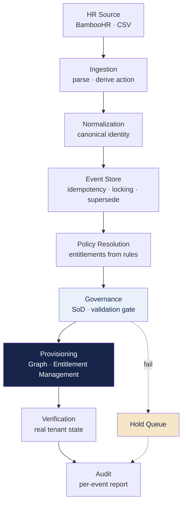
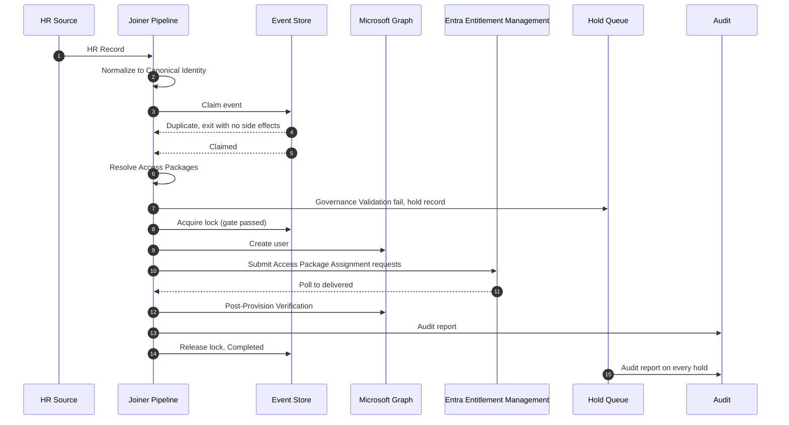
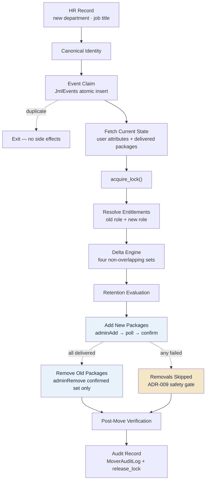
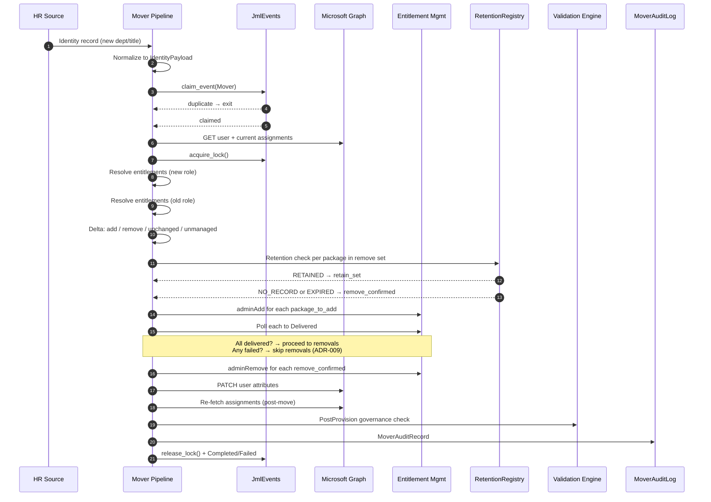
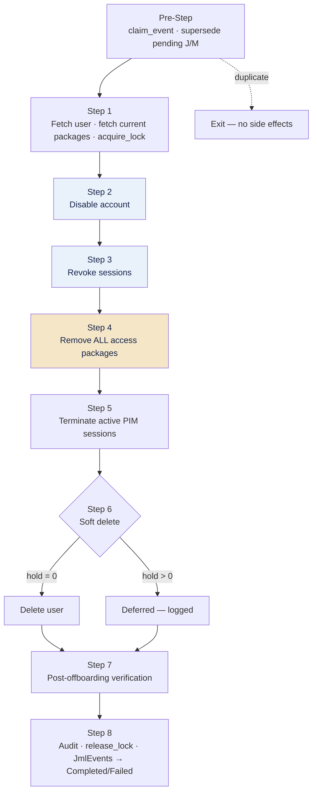
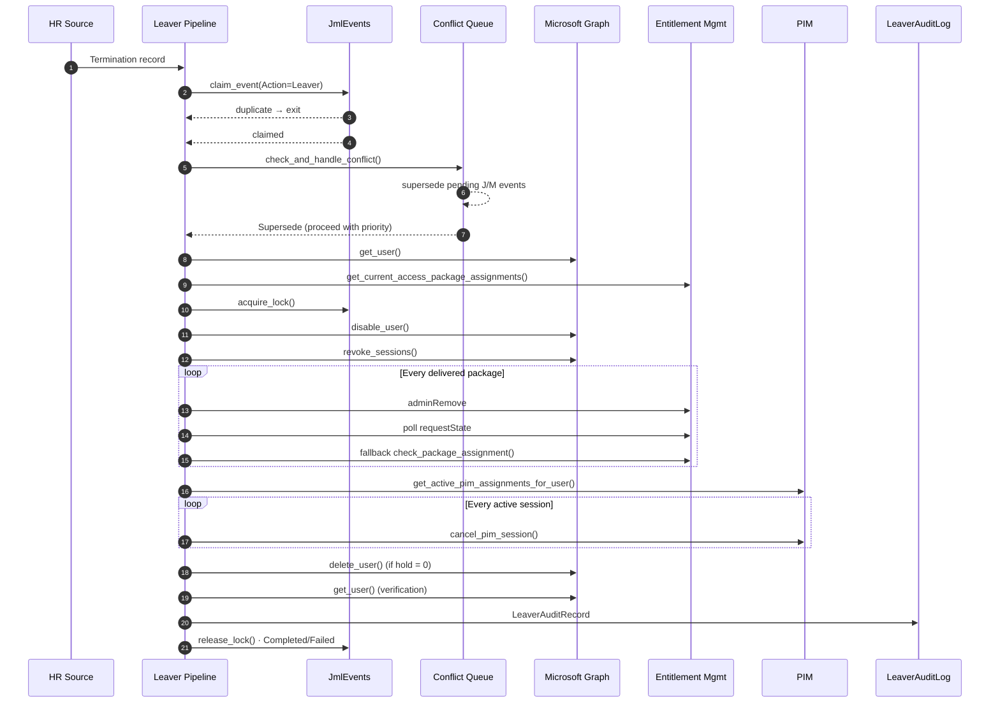
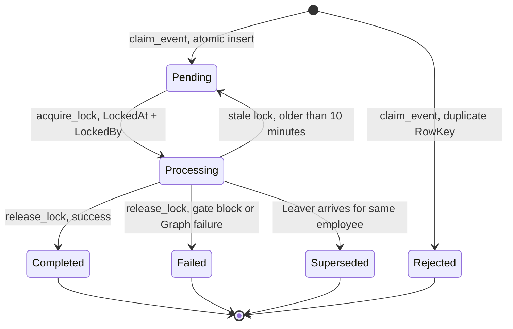
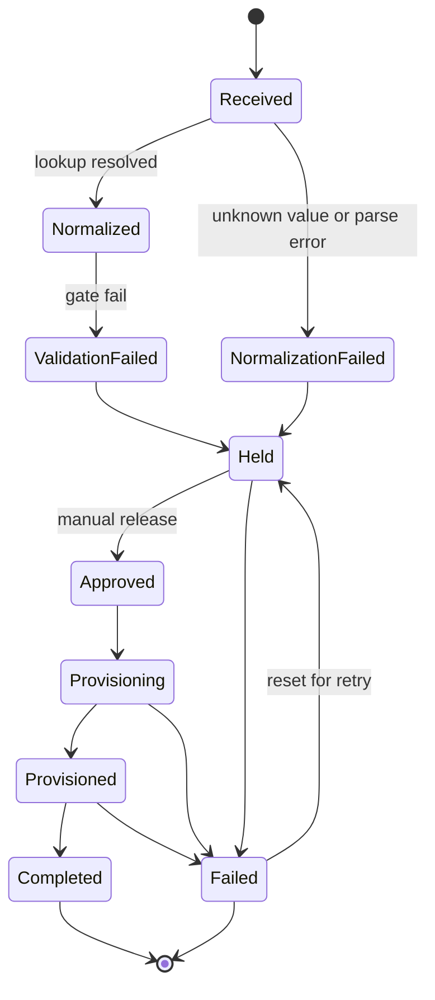
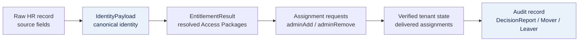

# Architecture — Policy-Driven Identity Lifecycle Engine

---

## Contents

1. System Overview
2. Architectural Model
3. Lifecycle Architecture
   - 3.1 Joiner
   - 3.2 Mover
   - 3.3 Leaver
4. Shared Core Components
5. Governance Architecture
6. State, Idempotency & Concurrency
7. Provisioning Architecture
8. Failure Handling
9. Audit Architecture
10. Data Flow
11. Azure Deployment Architecture
12. Architectural Boundaries
13. Future Evolution

---

## 1. System Overview

This engine automates the identity lifecycle — Joiner, Mover, Leaver — for Microsoft Entra ID. Most provisioning systems create the identity first and check the access afterwards, in an access review or a certification cycle weeks later. This engine reverses that order. Policy resolution and governance validation run *before* any Microsoft Graph write. If a record fails policy, nothing is created and nothing is changed. Every decision — pass or fail — is written as a per-event audit record at the moment it happens, not reconstructed from logs during an audit. (Write-once immutable storage for those records is planned, not yet in place — §9, §11.)

Access is delivered through Entra ID Entitlement Management Access Packages, never through direct group assignment (ADR-007). This is the single most consequential decision in the system. The engine reasons about packages; Entra delivers the groups, licences, and roles bundled inside them. A rule resolves to an `accessPackageId` and a `policyId`, an assignment request is submitted and polled to delivery, and group membership is a downstream consequence the engine never touches directly.

Three lifecycle branches sit on top of that primitive:

- **Joiner** provisions a new identity from nothing. It resolves entitlements from policy, validates, creates the user, and assigns packages.
- **Mover** handles a role or department change. It computes the delta between what the user currently holds and what the new role requires, then applies additions before removals so a failed change never strips access the user still needs.
- **Leaver** offboards a terminated identity. It disables the account and revokes sessions first, then removes every package the user holds, terminates active privileged sessions, and soft-deletes with a configurable hold.

Joiner and Mover share almost the entire pipeline and diverge only in the middle, at entitlement resolution. The Leaver is structurally different — it has no target state to resolve toward, so it skips resolution, delta, and retention entirely and moves in one direction: removal.

The stack is Microsoft-native throughout. Python 3.11 on Azure Functions orchestrates the flow, Microsoft Graph is the only execution interface, Azure Table Storage holds event and audit state, and a separately deployed PowerShell function runs governance validation over HTTP. HR events come from BambooHR live or from CSV for offline testing.

All three lifecycle branches are implemented and have run end to end against a live Entra ID tenant. The engine is deployed to Azure Functions (Flex Consumption) through a GitHub Actions CI/CD pipeline authenticated by OIDC; every change is tested against the tenant on the local Functions runtime first, then deployed. The Joiner's provisioning runs as an Azure Durable Functions orchestration in that deployment — its delivery poll is an orchestrator-driven timer loop rather than a blocking wait — while the Mover and Leaver are still synchronous and await the same migration. Several productionization pieces remain deliberately unbuilt: authentication is still Microsoft Graph client credentials in both environments (Managed Identity is not yet adopted), the governance validation engine is decoupled at the HTTP boundary and skipped in current runs until it is itself deployed, and Joiner audit reports are written as local JSON rather than to immutable blob storage. This is an honest middle state — live in Azure, but with productionization still in progress — and Section 11 (Azure Deployment), Section 12 (Architectural Boundaries), and Section 13 (Future Evolution) state exactly where each line falls.

---

## 2. Architectural Model

The architecture rests on four ideas. Everything else is a consequence of them.

### 2.1 Governance Decides Whether Provisioning Happens

The governance gate is not a post-provisioning audit. It runs *before* the first Graph write and it can stop the event. A canonical identity that fails validation never reaches Microsoft Graph — no user object is created, no package is assigned, and the record is held with structured reason codes for review.

This is the fail-closed contract. Degraded or incomplete input data blocks the event rather than proceeding on assumption. A false block is recoverable through human review; a missed violation, once written to the directory, is not. The system is built to fail in the recoverable direction.

The Leaver inverts the *sequencing* of this idea rather than dropping it. It has no entitlement gate to clear — removal is always safe — but it applies the same fail-safe instinct by disabling the account and revoking sessions before it touches any access. A partial failure downstream still leaves a terminated employee locked out.

### 2.2 Access Packages Are the Provisioning Unit

Entitlements resolve to Access Package IDs, not group object IDs (ADR-007). The delta engine operates on packages. The retention registry keys on packages. Post-provision verification queries the `assignments` resource filtered to delivered state, not `memberOf`.

This choice buys three things. Assignment is governed by Entra's own Entitlement Management policies, and access-package incompatibility relationships give Separation of Duties a natural platform-level home — the engine is designed to delegate SoD there rather than reimplement it, though that enforcement is planned, not yet configured (ADR-008, §5.4). Delivery is asynchronous and observable — a submitted request has a `requestState` the engine can poll to a terminal outcome rather than assume. And the unit of access maps to a business role rather than a scattered set of group memberships, which keeps both the policy model and the audit trail legible.

### 2.3 Layers With Single Responsibility

The pipeline is a linear sequence of layers, each with exactly one job and each calling only into the layer below it.



The boundaries are strict and they are the reason each layer can be tested and changed in isolation. Provisioning holds no policy logic. The policy engine makes no Graph calls. The audit layer makes no provisioning decisions. Change an access rule and the provisioning code is untouched; change how a package is assigned and the policy model doesn't move.

The governance validation engine sits behind an HTTP boundary as a separate PowerShell Azure Function in its own repository. The Python pipeline calls it and receives a structured pass-or-fail response. The two systems version and deploy independently — the governance rule set can change without redeploying the engine, and vice versa.

### 2.4 Deterministic and Idempotent by Construction

The same HR input produces the same entitlement outcome on every run. Runtime state does not influence the result. Each event carries a deterministic identifier — a SHA-256 hash of employee ID, action, and start date — and claims a row in a shared event store through an atomic insert. A retry, a duplicate HR trigger, and two concurrent function instances all collide on the same row and resolve to a single outcome. Double-provisioning is not an operational procedure to avoid; it is an architectural impossibility.

These four ideas apply across every lifecycle branch. The branches differ in what they resolve and in what order they write, but they share the same spine — the event store, the governance boundary, the provisioning interface, and the audit contract. Section 4 catalogues that spine.

---

---

## 3. Lifecycle Architecture

The engine runs three lifecycle pipelines — Joiner, Mover, and Leaver — on top of the shared core described in Section 4. They share the same event store, provisioning interface, verification step, and audit contract, and they diverge only where the lifecycle genuinely demands it. The Joiner resolves entitlements from nothing; the Mover resolves twice and applies a delta; the Leaver resolves nothing and moves in one direction, removal. Each is documented in full below.

---

## 3.1 Joiner

### 3.1.1 Purpose

The Joiner pipeline provisions a new identity from scratch. It is the only lifecycle branch that performs full entitlement resolution against policy — the identity has no prior state in Microsoft Entra ID, so there is nothing to compute a delta against and nothing to remove.

### 3.1.2 Stage Sequence

The Joiner pipeline runs as an ordered sequence of stages. A record only reaches the next stage if the current one passes; a failure at any gate routes the record to the hold queue and stops before any Microsoft Graph write.

1. **HR record ingestion.** An HR record enters from BambooHR or CSV and is normalized into a canonical identity.
2. **Event Store claim.** A SHA-256 EventId is derived from the identity and claimed atomically in the Event Store. A duplicate claim exits immediately with no side effects — this is what makes retries and duplicate HR triggers safe.
3. **Entitlement resolution.** The canonical identity is evaluated against policy rule objects to resolve which Access Packages the identity should hold. Multiple rules can contribute, and every resolved entitlement is traceable to the rule ID that produced it.
4. **Governance validation (pre-provision).** The canonical identity and resolved entitlements are submitted to governance validation before any Entra ID object exists. This is a synthetic-payload evaluation — zero Graph calls, no side effects.
5. **Lock acquisition.** Only once governance validation passes does the pipeline acquire the Event Store processing lock. A record that never clears the gate never holds a lock.
6. **User creation.** The Entra ID user object is created via Microsoft Graph.
7. **Access Package assignment.** The engine submits an Access Package assignment request for each resolved package.
8. **Delivery polling.** Each assignment request is polled to a terminal delivery state before the pipeline considers the assignment complete.
9. **Post-provision verification.** The real, now-provisioned Entra ID object is checked against the intended entitlement set.
10. **Audit report.** A structured report is written for the event regardless of outcome, and the Event Store lock is released.

In the deployed Azure runtime, stages 6 through 10 execute as an Azure Durable Functions orchestration rather than one blocking call. The HTTP entry point returns `202 Accepted` immediately with a status URL, and an orchestrator drives the sequence — create user, wait for user propagation on a durable timer, submit the package requests, then poll delivery through a check-activity-and-timer loop before recording and finalizing. The two waits that were `time.sleep` calls in the synchronous path (user propagation and the delivery poll interval) become orchestrator timers that hold no compute, so a delivery that takes minutes completes rather than being cut off at the gateway timeout. The synchronous Joiner path is retained alongside the durable one; §7.8 covers the orchestration in full. The Mover and Leaver remain synchronous pending the same migration.

Separation of Duties is not a stage on this path. SoD enforcement is planned as a platform-level control in Entra Entitlement Management (§5.4), not a Python check inside the pipeline. When configured, a conflicting assignment surfaces as a `Denied` request state during delivery polling (stage 8) rather than as a separate gate before provisioning.

### 3.1.3 Sequence Diagram



### 3.1.4 Why the Lock Comes After the Gate

The Event Store lock is acquired only after governance validation passes, not on claim. A record that fails normalization or governance validation is held and never takes a lock at all — both hold-queue exits happen upstream of lock acquisition. This keeps the lock's lifetime scoped to work that is actually going to touch Microsoft Graph.

### 3.1.5 Why Assignment Is Submitted, Then Polled, Not Assumed

Access Package assignment is asynchronous — a submitted request does not mean access has landed. The Joiner pipeline polls each assignment request to a terminal delivery state before treating provisioning as complete. This is why post-provision verification checks the real object rather than trusting the assignment request response: the Graph API call succeeding and the access actually being delivered are two different facts, and only the second one is true provisioning.

### 3.1.6 Entitlement Resolution Is Full, Not Delta

Unlike the Mover, the Joiner does not compute a delta. Entitlement resolution runs once, against policy, and every resolved Access Package is a managed package the engine is assigning for the first time. There is no unmanaged-package concept on the Joiner path — the identity has no pre-existing assignment to classify.

### 3.1.7 Dependencies

The Joiner pipeline depends on, but does not redefine:

- **Event Store** — for idempotent claim and lock lifecycle (§6).
- **Governance validation** — for the pre-provision gate (§5.3).
- **Provisioning** — for user creation, package assignment, and delivery polling (§7).
- **Post-provision verification** — for confirming the real tenant state after assignment (§7).
- **Audit** — for the per-event report (§9).

---

## 3.2 Mover

The Mover handles what most provisioning systems ignore entirely: what happens when someone changes role. It doesn't provision from scratch — it computes the difference between what a user currently holds and what their new role requires, evaluates that difference against retention policy, then applies the changes in a specific order designed to ensure the user never ends up with less access than they had before the transition started.

The architectural distinction from the Joiner is important: a Joiner resolves entitlements once, from nothing. A Mover resolves twice — once for the old role, once for the new — and the delta between those two resolutions is what drives every downstream decision.

### 3.2.1 Mover Lifecycle



### 3.2.2 Current-State Discovery

Before any computation begins, the Mover reads the user's actual state from Entra ID: their user attributes (department, job title, employment type) and their currently delivered Access Package assignments. This is the baseline everything else is measured against.

The unit of current state is the Access Package assignment, not raw group membership. The Mover queries the `assignments` resource filtered to `state eq 'delivered'`, not `memberOf`. Groups are a consequence of package assignment — the engine reasons about packages, and Microsoft Entra delivers the groups inside them.

The user's current `assignmentPolicyId` for each held package is captured at this point and carried forward to Step 7. When a package needs to be removed later, the removal request uses the policy ID from the real assignment on the tenant, not a re-derivation from `role_mapping_rules.json` — the tenant state is authoritative.

### 3.2.3 Entitlement Resolution — Old and New

The mapping resolver runs twice:

1. **New role** — resolves against the incoming HR record's department, job title, and employment type. This produces the target package set: what the user *should* hold after the transition.
2. **Old role** — resolves against the user's current Entra attributes (read at Step 1). This tells the engine what the user's *previous* role was entitled to under the same policy, which matters for computing the delta correctly.

Both resolutions read from `EntitlementResult.access_packages` — the list of `AccessPackageAssignment` objects, each carrying a `rule_id`, `access_package_id`, and `policy_id`. The legacy `.groups` field on `EntitlementResult` is not used by the Mover; every rule in the current `role_mapping_rules.json` resolves through `accessPackageId`/`policyId`.

### 3.2.4 The Delta Model

The delta engine is a pure function with no I/O. It takes three inputs — the user's current package set, the target package set, and the managed catalogue (every `accessPackageId` defined anywhere in the rules file) — and produces four non-overlapping sets:

```
                    Current Packages
                          +
                    Target Packages
                          +
                    Managed Catalogue
                          ↓
                      Delta Engine
                          ↓
        ┌─────────┬───────────┬──────────┬───────────┐
   packages    packages    unchanged   unmanaged
   to add      to remove
```

**Packages to add** — in the target set but not currently held. These are the new role's entitlements that need to be provisioned.

**Packages to remove** — currently held, in the managed catalogue, but not in the target set. These are the old role's entitlements that the new role doesn't need. Only managed packages appear here — the engine never removes access it didn't assign.

**Unchanged** — currently held and still required by the new role. No action needed, but included in the expected state for post-move verification.

**Unmanaged** — currently held but not present anywhere in the managed catalogue. These are packages assigned outside the engine (manually in the portal, through a different workflow, or from a rule that was later deleted). The engine does not touch them, does not evaluate them for retention, and does not include them in SoD checks. They are recorded in the audit report as `NOT_PROCESSED` (ADR-005) and excluded from the post-move verification's unexpected-membership check so their presence doesn't trigger a false discrepancy.

### 3.2.5 Retention Evaluation

Before any package in the removal set is confirmed for removal, the engine checks the `RetentionRegistry` table. This is a resource-oriented lookup: each record is keyed on `resourceType` (e.g. `"accessPackage"`) and `resourceId`, with a composite RowKey of `f"{resource_type}:{resource_id}"` to avoid ID collisions across resource types sharing the same table.

The decision logic is pure and has three outcomes:

- **RETAINED** — a valid record exists with a `review_date` in the future. The package moves to the retain set and is excluded from removal. It becomes part of the expected post-move state alongside unchanged packages.
- **EXPIRED** — a record exists but its `review_date` has passed. The package proceeds to confirmed removal.
- **NO_RECORD** — no retention entry exists. The package proceeds to confirmed removal. The burden of proof is on keeping access, not on removing it.

The engine reads from `RetentionRegistry` but does not write to it. Population requires an access request workflow or manual entry. This separation is deliberate — the registry is policy, not engine state.

### 3.2.6 SoD Posture

The Mover does not run a Python-side Separation of Duties check before executing access changes (ADR-008). SoD enforcement is delegated to the platform level — Entra ID Entitlement Management access package incompatibility policies. The intent is that when the engine submits an `adminAdd` request for a new package, Microsoft evaluates the configured incompatibility relationships and rejects the request if a conflict exists. Those incompatibility policies are not yet configured, so this enforcement point is planned rather than active (§5.4).

A pre-flight incompatibility check (ADR-011) is designed but deferred. When built, it will query Entra's `incompatibleAccessPackages` and `incompatibleGroups` endpoints before submitting requests, and select between two execution strategies rather than always assuming add-first is safe. Until then, Strategy A (add-before-remove) is the only execution path, and a platform rejection surfaces through the polling step as a `Denied` or `Failed` requestState.

### 3.2.7 Execution Ordering — ADR-009

This is the most architecturally significant decision in the Mover pipeline. The legacy group-based Mover removed old access before adding new access — order didn't matter for direct group membership. Access Packages are different.

**The rule: additions must be confirmed delivered before any removal executes.**

The reason is a failure-mode analysis. If the engine removes old access first and the subsequent addition fails (transient Graph error, incompatibility rejection, polling timeout), the user is left with strictly less access than they had before the move — no old role access, no new role access. That's a worse outcome than the alternative failure mode under add-first ordering, where a failed removal leaves the user temporarily holding both old and new access until the next run or manual cleanup resolves it. Stale-but-present access is recoverable. Missing access disrupts the employee's work immediately.

The gate is all-or-nothing: removals only proceed if every package in the addition set reached a `Delivered` state. There is no guaranteed one-to-one pairing between an added package and a removed package in a given delta (a department change might add one package and remove two, or vice versa), so per-pair gating would be both complex and semantically wrong. The addition set either fully delivered or it didn't.

### 3.2.8 Package Assignment and Polling

Each addition is submitted as an `adminAdd` request through the Entitlement Management `assignmentRequests` endpoint and polled to a terminal `requestState` (`Delivered`, `Denied`, `Failed`, or `Canceled`). This mirrors the Joiner's polling pattern.

A fallback confirmation mechanism addresses a recurring pattern observed in testing: transient network timeouts during polling that cause the engine to lose track of a request that Entra actually processed successfully. When polling does not reach a terminal state within the configured window, the engine queries the `assignments` resource directly (a different Graph endpoint from the one that timed out) to check whether the package was actually delivered. This is a genuine second opinion, not a retry of the same flaky call.

Removals follow the same submit-and-poll pattern using `adminRemove` as the request type. The `policy_id` for each removal comes from the user's actual current assignment (captured at Step 1), not from re-resolving entitlements — the tenant state is the authoritative source for what policy governs an existing assignment.

### 3.2.9 Attribute Patching

Identity attributes (department, job title, employment type) are patched on the Entra user object as part of the Mover pipeline. Two fields are currently excluded from the PATCH body: `usageLocation` (requires an ISO 3166-1 alpha-2 country code; the HR source sends city names) and `manager` (requires a separate Graph endpoint from the standard user PATCH).

### 3.2.10 Post-Move Verification

After package changes and attribute patching complete, the engine re-fetches the user's actual Access Package assignments from Entra and compares them against the expected post-move state:

```
Expected = unchanged ∪ retain_set ∪ packages_to_add
```

Two categories are excluded from the unexpected-assignment check: unmanaged packages (outside the managed catalogue by design) and recently removed packages (confirmed removed but possibly not yet propagated due to Graph eventual consistency). A configurable delay (default 10 seconds) runs before the fetch to account for propagation lag.

The PowerShell governance validation engine then runs in PostProvision mode against the real Entra object — the same check the Joiner runs after provisioning. Currently decoupled via `JML_SKIP_VALIDATION_ENGINE=true` and reintegrated once the validation engine is itself deployed alongside the pipeline.

A clean verification produces `MOVE_SUCCESS`. Any discrepancy — a missing expected package, an unexpected unaccounted-for package, or a governance validation failure — produces `MOVE_PARTIAL`. A verification fetch failure produces `MOVE_FAILED`.

### 3.2.11 Mover Sequence



### 3.2.12 Architectural Decisions Governing the Mover

| ADR | Decision | Effect on the Mover |
|-----|----------|-------------------|
| ADR-005 | Unmanaged access is not touched | Packages outside the managed catalogue are excluded from removal, SoD, and retention — recorded as NOT_PROCESSED |
| ADR-007 | Access Packages are the provisioning unit | Delta operates on package IDs, not group IDs. Group membership is a downstream consequence |
| ADR-008 | SoD enforcement at the platform level | No Python SoD check before writes. Entra's own incompatibility policies are the intended enforcement point (planned, §5.4) |
| ADR-009 | Add-before-remove ordering | Additions must be confirmed delivered before any removal executes. A failed addition never results in access loss |
| ADR-011 | Pre-flight incompatibility check (deferred) | When built, queries Entra's configured incompatibility relationships to choose between add-first (Strategy A) and remove-first (Strategy B) per package |

---

## 3.3 Leaver

The Leaver pipeline offboards a terminated identity. It is structurally different from the Joiner and Mover — there is no entitlement resolution, no delta calculation, no retention evaluation, and no governance validation gate. The pipeline's only question is: what does this user currently hold, and how do we remove all of it safely?

That simplicity is deliberate, not accidental. A Leaver has no target state to resolve towards. Its target is `current − everything`. The architectural decisions that make the Joiner and Mover complex — policy resolution, delta sets, retention records, SoD checks — exist to answer "what should this person have?" A terminated employee's answer is always the same.

### 3.3.1 Why the Leaver Pipeline Has a Different Shape

Three properties distinguish the Leaver from the other two pipelines:

**No entitlement resolution (ADR-014).** The Joiner resolves entitlements from policy. The Mover resolves entitlements for both the old and new role, then diffs them. The Leaver skips this entirely — it fetches the user's current Access Package assignments from the tenant and removes all of them. This also means the Leaver skips normalisation in the ingestion layer, since canonical department and job title resolution exists to serve entitlement resolution.

**No retention, no unmanaged exclusion (ADR-014).** On a Mover, the retention registry can exclude specific packages from removal, and unmanaged packages (access the engine didn't assign) are left untouched. On a Leaver, both protections are removed. Retention exists to bridge a role transition — a terminated employee has no transition to bridge. An unmanaged package on a terminated identity is exactly the kind of leftover access offboarding exists to catch — leaving it alone would be the unsafe choice, not the conservative one.

**Disable before remove (ADR-015).** The Mover's sequencing concern is avoiding a zero-access gap (ADR-009: add before remove). The Leaver has the opposite concern — it wants to reach zero access safely. Disabling the account and revoking sessions before touching packages means a partial failure at any later step still fails safe: the account is already locked out.

### 3.3.2 Pipeline Steps



Steps 2 and 3 (disable, revoke) execute before any access removal. This is the fail-safe ordering from ADR-015 — once those two steps complete, the identity cannot authenticate regardless of what happens at Steps 4–6.

### 3.3.3 Pre-Step — Event Claim and Conflict Supersede

The Leaver claims its event in `JmlEvents` via `claim_event()`, the same atomic insert used by Joiner and Mover. A duplicate event ID (same employee, same action, same termination date) exits immediately with no side effects.

After claiming, the Leaver calls `check_and_handle_conflict()`. For a Leaver, this supersedes all Pending Joiner and Mover events for the same employee — they become `Superseded` and will never execute. This prevents a race condition where a pending Mover runs after the Leaver has already disabled the account:

```
Without supersede:              With supersede:

Mover pending                   Mover pending
    ↓                               ↓
Leaver arrives                  Leaver arrives
    ↓                               ↓
Leaver disables account         Mover → Superseded
    ↓                               ↓
Old Mover executes              Leaver disables account
    ↓                               ↓
Mover fails or corrupts state   Clean offboarding
```

A Processing event (one already running, not just pending) is not superseded — it cannot be safely interrupted mid-execution. That case is expected to be rare, since Processing events hold a lock that expires after ten minutes.

### 3.3.4 Step 1 — Current State Discovery

The pipeline fetches the user via `get_user()` and their current Access Package assignments via `get_current_access_package_assignments()`. The assignment response is expanded to include `assignmentPolicy($select=id)`, which provides the `assignmentPolicyId` needed for `adminRemove` requests at Step 4.

`acquire_lock()` is written to `JmlEvents` after a successful fetch, preventing concurrent processing of the same event.

A failed user fetch or assignment fetch routes to `_handle_early_failure()`, which writes a `LeaverAuditLog` record and releases the lock if one was acquired — no terminal path exits without producing an audit record.

### 3.3.5 Step 2 — Disable Account (ADR-015)

`disable_user()` sets `accountEnabled = false` via a standard Graph PATCH. This is the first mutation the pipeline performs, and it is first for a reason: every subsequent step operates on an account that is already locked out. If Step 4's package removal fails partway through, the terminated employee cannot use whatever access remains.

### 3.3.6 Step 3 — Revoke Sessions (ADR-015)

`revoke_sessions()` calls the `revokeSignInSessions` Graph endpoint. Setting `accountEnabled = false` at Step 2 does not invalidate tokens already issued — a user with an active session could continue operating for the lifetime of their existing token. This step forces re-authentication on all devices, which the disabled account will reject.

Steps 2 and 3 together form the "lock the door" phase. Steps 4–6 are "clean out the room."

### 3.3.7 Step 4 — Remove All Access Packages (ADR-014)

Every currently delivered Access Package is submitted for `adminRemove`, with no exceptions:

- Packages the engine assigned through policy resolution are removed.
- Packages assigned outside the engine (unmanaged) are removed.
- Packages with active retention records are removed. Retention bridges role transitions, which a termination is not.

Each removal is submitted via `request_package_assignment(request_type="adminRemove")`, polled to a terminal `requestState`, and confirmed via a fallback `check_package_assignment()` call if the poll times out or fails. Individual removal failures are recorded but do not stop remaining removals — a partial removal set still leaves the user with less access than none at all, and Step 7's verification surfaces exactly what didn't clear.

The `assignmentPolicyId` for each removal comes from the expanded `assignmentPolicy.id` on the user's real current assignment, not from re-deriving a policy through `role_mapping_rules.json`. The real assignment on the tenant is the authoritative source.

### 3.3.8 Step 5 — Terminate Active PIM Sessions (ADR-016)

This step is a deliberate departure from ADR-003, which established that the Mover lets active PIM sessions expire naturally to avoid interrupting mid-task work. ADR-016 reverses that for the Leaver: a terminated employee has no legitimate in-progress work to protect, and a live privileged session is an active risk for as long as it runs.

Discovery is tenant-wide via `get_active_pim_assignments_for_user()`, which queries `assignmentScheduleInstances` (actually activated sessions) filtered only by `principalId`. This is distinct from the Mover's `get_active_pim_sessions()`, which queries `eligibilityScheduleInstances` (eligible to activate, not activated). The Leaver needs to find whatever is live right now, without already knowing which groups to check — it has no entitlement resolution to draw a candidate group list from.

Each active session is terminated via `cancel_pim_session()`, which posts an `adminRemove` to `assignmentScheduleRequests`.

This step requires `PrivilegedAssignmentSchedule.Read.AzureADGroup` (or equivalent) on the app registration. If the permission is absent, or P2 licensing is not available, the step records a warning and the pipeline continues — PIM termination is an additional security control on top of package removal, not a prerequisite for it.

### 3.3.9 Step 6 — Soft Delete

`delete_user()` issues a standard Graph DELETE, which moves the user to the Entra ID deleted-users container (recoverable for 30 days by default).

This step is gated by `JML_LEAVER_SOFT_DELETE_HOLD_DAYS`. When the hold is nonzero, the step logs a deferral and does not delete — everything before it has already locked the account out and stripped its access, so a delayed deletion is safe. When the hold is zero, deletion happens immediately.

The hold is evaluated at pipeline execution time only. There is no background timer that returns later to finish the deletion. A deferred delete requires either a re-run of the pipeline (which `claim_event` will reject as a duplicate — see ADR-013 for the reclaim design that would allow this) or a Reconciliation event (ADR-012, not yet built) to complete.

### 3.3.10 Step 7 — Post-Offboarding Verification

The pipeline verifies the actual tenant state:

- **Account disabled** — re-fetches the user and confirms `accountEnabled` is `false`. If the user was soft-deleted at Step 6, a failed `get_user()` call is treated as confirmation (deleted implies disabled).
- **Packages cleared** — checks whether any removal failures were recorded at Step 4.
- **User deleted** — records whether the soft delete executed or was deferred.

The verification result determines the final status:

| Condition | Status |
|---|---|
| Account disabled confirmed, all packages cleared | `OFFBOARD_SUCCESS` |
| Account disabled but some packages unconfirmed, or deletion deferred with a nonzero hold | `OFFBOARD_PARTIAL` |
| Verification itself failed (e.g. Graph error on re-fetch) | `OFFBOARD_FAILED` |

### 3.3.11 Step 8 — Audit and Lock Release

A `LeaverAuditRecord` is written to `LeaverAuditLog` in Azure Table Storage, capturing the full set of packages held at offboard start, every action taken (disable, revoke, each package removal, each PIM termination, soft delete), all warnings, and the verification result.

`LeaverEventLog` is updated to the terminal status. The `JmlEvents` lock is released and the event status is updated to `Completed` or `Failed`. The lock is released on every exit path, including early failures at Step 1.

### 3.3.12 Leaver Sequence



### 3.3.13 Table Storage

| Table | Purpose | Shared? |
|---|---|---|
| `JmlEvents` | Event store, idempotency, concurrency lock | Yes — shared across all pipelines |
| `LeaverEventLog` | Leaver event status tracking | Leaver only |
| `LeaverAuditLog` | Completed Leaver audit records | Leaver only |

No `LeaverHoldQueue` exists. The Leaver has no governance gate or SoD check that would hold an event — a Graph API failure routes straight to `Failed` on `JmlEvents`. This is a structural simplification, not an omission (see §8.5 for the recovery-path gap this leaves open).

### 3.3.14 ADR Dependencies

| ADR | Effect on Leaver |
|---|---|
| ADR-003 | Mover lets PIM sessions expire naturally. **ADR-016 reverses this for Leaver** — active sessions are terminated immediately. |
| ADR-007 | Access Packages are the provisioning unit. The Leaver removes packages, not raw groups. |
| ADR-014 | Full removal scope. No retention check, no unmanaged exclusion, no entitlement resolution. |
| ADR-015 | Disable and revoke before access removal. Soft delete last with configurable hold. |
| ADR-016 | Active PIM session termination. Queries `assignmentScheduleInstances`, not `eligibilityScheduleInstances`. |

---

## 4. Shared Core Components

The three lifecycle pipelines are not three separate systems. They share a common spine and diverge only where the lifecycle genuinely demands it. This section names each shared component, states which pipelines use it, and points to the section that owns its full design. Nothing here is redefined later — the lifecycle sections and the deep-dive sections build on these components rather than restating them.

### 4.1 What Is Shared, and by Whom

| Component | Joiner | Mover | Leaver | Owned by |
|---|:---:|:---:|:---:|---|
| Ingestion + action derivation | ✓ | ✓ | ✓ | §10 Data Flow |
| Canonical normalization | ✓ | ✓ | — | §3.1–3.2 Lifecycle |
| Event Store (claim · lock · deterministic ID) | ✓ | ✓ | ✓ | §6 State, Idempotency & Concurrency |
| Conflict queue (FIFO · Leaver supersede) | ✓ | ✓ | ✓ | §6 State, Idempotency & Concurrency |
| Entitlement resolution | ✓ | ✓ | — | §5 Governance |
| Governance validation gate | ✓ | ✓ | — | §5 Governance |
| Graph / Entitlement Management client | ✓ | ✓ | ✓ | §7 Provisioning |
| Post-provision / post-offboarding verification | ✓ | ✓ | ✓ | §7 Provisioning |
| Hold queue | ✓ | ✓ | — | §8 Failure Handling |
| Audit record | ✓ | ✓ | ✓ | §9 Audit Architecture |

Two things stand out. The Event Store, the conflict queue, the Graph client, verification, and the audit contract are used by all three pipelines — that is the true shared core. The governance machinery (normalization, resolution, the validation gate, the hold queue) is shared by Joiner and Mover but skipped entirely by the Leaver, because a terminated identity has no target state to resolve toward and removal needs no gate.

Separation of Duties is deliberately absent from the table above: no pipeline enforces it today. It is planned as a platform-level control delegated to Entra Entitlement Management, and §5.4 states exactly where that stands.

### 4.2 The Event Store

`JmlEvents` is engine-wide. Every lifecycle event, whatever its type, claims a row through the same atomic insert and acquires the same processing lock. There is no per-module event table. This is the foundation of both idempotency and concurrency control, and it is what lets a Leaver supersede a pending Joiner or Mover for the same employee — they all live in one store. Section 6 covers the deterministic identifier, the claim-and-lock lifecycle, the ten-minute lock expiry, and the conflict queue's FIFO and supersede rules.

### 4.3 Entitlement Resolution

The mapping resolver evaluates named policy rules from `role_mapping_rules.json` against a canonical identity and unions the matched entitlements into a set of Access Package assignments, each traceable to the rule ID that produced it. The Joiner runs it once. The Mover runs it twice — old role and new role — and diffs the results. The Leaver never runs it. Because every entitlement carries its rule ID, every access decision is traceable back to policy in the audit report. Section 5 covers the rule schema and the resolution model.

### 4.4 Governance Validation

Governance validation is a separately deployed PowerShell Azure Function, called over HTTP. It evaluates a canonical payload before provisioning (synthetic snapshot, zero Graph calls) and the real object after provisioning (against actual tenant state). The Python side wraps both calls behind a single gate that blocks on any failure and passes warnings through without blocking. The engine is currently decoupled at this boundary for independent testing — the call is skipped via `JML_SKIP_VALIDATION_ENGINE=true` — and is reintegrated once the PowerShell validation engine is itself deployed as its own function app (the pipeline is already in Azure; the validation engine is the piece not yet deployed). Section 5 covers the request modes, the response contract, and the two gates.

### 4.5 Separation of Duties (Planned)

No pipeline enforces Separation of Duties today. The design intent (ADR-008) is to delegate it to Entra Entitlement Management access-package incompatibility policies, so that Entra rejects an `adminAdd` request when it would produce a conflicting combination — enforcement at the platform, not reimplemented in the engine. This is not yet built or configured. Section 5.4 covers the intended model and the reasoning behind delegating rather than owning the check.

### 4.6 Provisioning Interface

Microsoft Graph is the sole execution interface, accessed through a single client that handles authentication, retry on throttling, and the Entitlement Management endpoints. All three pipelines write through it. Every write is submitted and then polled to a terminal state, and every write is safe to repeat. Section 7 covers the assignment request lifecycle, the delivery-polling pattern, the fallback confirmation mechanism, and the verification step that checks real tenant state rather than trusting a Graph API response.

### 4.7 Audit

Every event produces exactly one record, written at the time of processing regardless of outcome, and written once by the engine's own logic. The three pipelines write three record types — `DecisionReport` for the Joiner, `MoverAuditRecord` for the Mover, `LeaverAuditRecord` for the Leaver — but the contract is identical: capture every action taken, every rule that fired, every warning, and the final verification result, with enough detail that a partial failure produces a precise record of what succeeded before it. Storage-enforced immutability (write-once blob with a retention policy) is planned but not yet in place. Section 9 covers the record shapes and the current storage model.

---

## 5. Governance Architecture

Governance in this engine is not a scan you run afterwards. It is the set of controls that decide whether provisioning happens at all, and they run before the first Microsoft Graph write. Three of them: policy resolves entitlements from validated attributes, a validation gate evaluates the result against a governance rule set, and Separation of Duties conflicts are (by design) rejected at the platform. Two of the three are built. The third is planned. This section says which is which.

### 5.1 The Governance-First Model

The ordering is the whole point. Entitlements are resolved from a canonical identity, checked, and only then written. A record that fails resolution or validation is held with structured reason codes and never reaches the tenant — no user object, no package assignment, nothing to remediate later.

This is fail-closed by design. If the input data is degraded or a dependency returns an incomplete result, the event blocks rather than proceeding on a guess. A false block is recoverable through review; a bad grant, once written to the directory, has to be found and reversed. The system is built to fail in the recoverable direction.

The Leaver sits outside this model. It has no entitlement to resolve and no gate to clear — removal is always the safe direction — so it skips resolution and validation entirely. Governance, for the Leaver, means the fail-safe sequencing covered in §3.3, not a pre-provision gate.

### 5.2 Entitlement Resolution

Resolution is where policy becomes access. The mapping resolver loads named rules from `role_mapping_rules.json` and evaluates every one against the canonical identity. A rule matches on job title, department, and employment type using three operators — `exact`, `contains`, and `startsWith` — and contributes a set of Access Packages when it matches.

```json
{
  "id": "FIN-ANALYST-001",
  "description": "Finance Analyst baseline access",
  "conditions": {
    "department":     { "operator": "exact",    "value": "Finance" },
    "jobTitle":       { "operator": "contains", "value": "Analyst" },
    "employmentType": { "operator": "exact",    "value": "Employee" }
  },
  "entitlements": {
    "accessPackages": [
      { "accessPackageId": "b1f2…", "policyId": "9c3a…" }
    ]
  }
}
```

Three properties matter architecturally.

**All matches contribute, not the first.** The resolver evaluates every rule and unions the matched entitlements. Several rules can layer access onto one identity — a department baseline, a job-title package, an employment-type grant — and the result is their union, not the first rule that happened to fire.

**Every entitlement is traceable to a rule ID.** Each resolved package is an `AccessPackageAssignment` carrying its `rule_id`, `accessPackageId`, and `policyId`. That rule ID travels through the pipeline into the audit report, so every grant answers the question "which policy put this here?" without reconstruction.

**Packages are the unit, not groups.** Every rule in the current rules file resolves through `accessPackageId`/`policyId`. The legacy `.groups` field from the group-based engine is not read on this path. The engine resolves packages; Entra delivers the groups inside them.

The Joiner resolves once, against the incoming record. The Mover resolves twice — once against the user's current Entra attributes (old role) and once against the incoming record (new role) — and diffs the two sets to drive its delta. The Leaver never resolves. Resolution is a pure evaluation over policy and identity; it makes no Graph calls and has no side effects, which is why it can run before anything is written and be unit-tested without a tenant.

### 5.3 The Validation Gate

Resolution decides what access *should* exist. The validation gate decides whether an identity is *fit to provision*. It is a separately deployed PowerShell Azure Function — the Identity Governance Validation Engine — called over HTTP. The two systems are decoupled at that boundary and version independently: the governance rule set can change without redeploying the Python engine.

The gate runs in two modes.

**PreProvision (payload).** Before any Entra object exists, the canonical payload is evaluated against a synthetic snapshot. Zero Graph calls, no side effects. This is the pre-provision gate — employment-type constraints, UPN conflicts, missing manager associations, and privilege-tier checks all run here against an identity that does not yet exist.

```json
{
  "mode": "PreProvision",
  "payload": {
    "EmployeeId": "E501", "UPN": "claire.dubois@contoso.com",
    "Department": "Finance", "JobTitle": "Head of Finance",
    "EmploymentType": "Employee", "Action": "Joiner"
  }
}
```

**PostProvision (state).** After provisioning, the gate fetches the real object and evaluates actual tenant state. Hygiene rules (`HYG-*`) are demoted to warnings on this path regardless of their blocking flag — a freshly created account has never signed in and cannot have MFA registered yet, so treating those as failures would block every legitimate new identity.

```json
{ "mode": "PostProvision", "targetUserId": "entra-object-id" }
```

Both calls return the same shape, and the Python side wraps them behind one gate:

```json
{
  "passed": true,
  "failures": [],
  "warnings": [
    { "ruleId": "HYG-004", "category": "Hygiene", "severity": "Critical",
      "details": "Privileged account has no MFA registration or MFA is not enforced." }
  ],
  "matchedRuleIds": ["HYG-004"]
}
```

The contract is simple: any entry in `failures` blocks provisioning and routes the record to the hold queue as `ValidationFailed`; `warnings` pass through without blocking. The gate decides pass or fail; it never decides what to provision.

**Current status.** The validation gate is decoupled for independent testing. Runs skip the call via `JML_SKIP_VALIDATION_ENGINE=true`, and the gate is reintegrated once the PowerShell validation engine is deployed as its own function app and the two run in the same environment. The pipeline itself is already in Azure; it is the validation engine that is not yet deployed. The design is complete and the contract is stable; the integration is toggled off in current runs. This is stated plainly because the rest of this section describes a gate that is present in the architecture but not active in every run today.

### 5.4 Separation of Duties (Planned)

No pipeline enforces Separation of Duties today. This is a deliberate design position, not an oversight, and it is worth being precise about.

The group-based predecessor to this engine ran a Python preventive SoD check against the effective access set before any write, plus a detective check inside the validation engine's tenant scan. Moving to Access Packages changes where that control belongs. Entra Entitlement Management supports incompatibility relationships between access packages: configure package A as incompatible with package B, and Entra rejects an assignment request that would give one identity both. That rejection surfaces through the same delivery-polling the engine already does — a `Denied` or `Failed` `requestState` on the `adminAdd` — so the engine gets SoD enforcement without reimplementing the conflict catalogue or fetching current memberships to evaluate it.

The decision (ADR-008) is to delegate SoD to that platform mechanism rather than own it in Python. The trade is clear: the platform is the authoritative place to enforce incompatibility on packages, and a single enforcement point beats two catalogues that can drift apart. What remains is to configure the incompatibility relationships in the tenant and to build the pre-flight check (ADR-011) that would query Entra's configured incompatibilities before submitting requests, so the engine can choose an add-first or remove-first strategy per package rather than always assuming add-first is safe. Both are designed and neither is built.

Until then, SoD is not enforced anywhere in the pipeline. The engine will not create a conflicting combination through policy that happens to be clean, but it also does not stop one. §13 tracks this as the next governance capability.

---

## 6. State, Idempotency & Concurrency

Every lifecycle event, whatever its type, passes through one shared event store before it is allowed to do anything. `JmlEvents` is engine-wide — there is no per-module event table — and it is the single mechanism behind three guarantees: the same event is never processed twice, two instances never process the same event at once, and a Leaver always wins over a pending Joiner or Mover for the same employee.

### 6.1 One Store for Every Pipeline

`JmlEvents` is keyed on `PartitionKey = employee_id` and `RowKey = event_id`. Joiner, Mover, and Leaver all claim a row here and all acquire the same lock. Making the store engine-wide rather than per-module is what makes cross-pipeline coordination possible at all — a Leaver can only supersede a pending Mover because both events live in the same table under the same employee partition.

### 6.2 Deterministic Event Identifiers

The event ID is not random. It is a hash of the facts that define the event:

```
EventId = SHA-256(EmployeeId + "|" + Action + "|" + StartDate)   truncated to 32 chars
```

The same input always produces the same ID, which is what lets the store recognise a duplicate. `StartDate` is in the hash on purpose: a re-hire after a Leaver produces a distinct ID rather than colliding with the original Joiner, so the two events are genuinely separate rows rather than one being mistaken for a replay of the other.

### 6.3 Idempotency — the Atomic Claim

`claim_event()` attempts an atomic insert of the event row. Azure Table Storage rejects a duplicate `RowKey` at the infrastructure level — not in application code, in the storage layer. If the row already exists, the insert fails and the pipeline exits immediately with no provisioning and no error.

That single mechanism handles every way a duplicate can arrive. A retry after a transient failure, a duplicate HR trigger, a manual re-run, two concurrent invocations from the same webhook — all of them compute the same deterministic ID and all of them hit the same rejection. Double-provisioning isn't a case the code has to reason about; it's a state the storage layer refuses to enter.

### 6.4 Concurrency — the Lock

The atomic claim isn't quite enough on its own. Two instances can both pass `claim_event()` in the narrow window before either writes a lock, so a second guard is needed. `acquire_lock()` writes a `LockedAt` timestamp and a `LockedBy` instance ID to the event row; the second instance reads the active lock and exits.

Where the lock is acquired differs by pipeline, and the difference is meaningful:

- **Joiner** acquires the lock *after* the governance gate passes. A record that never clears validation never takes a lock — both hold-queue exits happen upstream, so the lock's lifetime is scoped only to work that will actually touch Graph.
- **Mover** and **Leaver** acquire the lock *after* the current-state fetch succeeds, because both need the user's real tenant state before they can do anything, and there is no pre-fetch gate to wait on.

Locks expire automatically after ten minutes. A crashed instance therefore does not block the next run indefinitely — a stale lock is reset to `Pending` and reclaimed. And `release_lock()` is called on every exit path, success or failure: a SoD hold, a removal failure, an early Graph error at the fetch step. No row stays locked after processing ends.

### 6.5 The Event State Machine



Every event lands in exactly one terminal state. `Rejected` is a duplicate that never ran. `Completed` and `Failed` are the two normal outcomes. `Superseded` is a pending event a Leaver cancelled. Nothing exits the machine silently — every path ends in a named state and an audit record.

### 6.6 The Conflict Queue

The lock stops two instances touching the *same* event. The conflict queue handles the harder case: multiple *different* events for the same employee, arriving close together.

Events for one employee are ordered FIFO. A new event arriving while another is active for that employee is queued in arrival order, and if the preceding event failed, the queue waits for human review before the next one runs rather than racing ahead on top of a bad state.

The Leaver is the exception to FIFO, and it has to be. When a Leaver arrives, it supersedes every *pending* Joiner and Mover for that employee — they transition to `Superseded` and never execute. Without that rule, a Mover queued before the termination could run *after* the account was already disabled, and either fail noisily or, worse, partially re-enable access on a terminated identity.

```
Without supersede                     With supersede
─────────────────                     ─────────────────
Mover pending                         Mover pending
Leaver arrives                        Leaver arrives
Leaver disables account               Mover → Superseded
Stale Mover executes                  Leaver disables account
Access re-touched on a leaver         Clean offboarding
```

One boundary: a *Processing* event — one already running, holding a live lock — is not superseded. It cannot be safely interrupted mid-execution, so the Leaver lets it finish. That case is expected to be rare, because a Processing lock expires after ten minutes and pending is by far the more common state for a queued event.

---

## 7. Provisioning Architecture

Microsoft Graph is the only place this engine writes. Every user creation, package assignment, PIM change, and offboarding action goes through a single client, and every one of them is submitted, then confirmed — never assumed. This section covers how that client is built, how it survives a throttled or flaky tenant, why every write is safe to repeat, and why a Graph API returning `200` is treated as the start of provisioning rather than the end of it.

### 7.1 The Graph Client Boundary

`JmlGraphClient` is a thin wrapper around the Microsoft Graph SDK, and its first job is to hide a mismatch. The SDK is asynchronous and speaks in SDK model objects; the pipeline is synchronous and wants plain dictionaries. A single internal `_run()` executes each async SDK coroutine to completion, so the entire pipeline above this class stays linear — no `async`/`await` leaks past the client boundary.

The client uses two calling styles depending on what the SDK models well:

- **SDK-native calls** for the well-modelled surface: user create and fetch, group membership check and add, RBAC assignment check and create, account disable, and delete.
- **Raw `httpx` calls** for the endpoints the SDK does not fully model: everything under Entitlement Management (`assignmentRequests`, `assignments`), all of PIM (eligibility and active-session schedules), and `revokeSignInSessions`. These build the request, attach a bearer token from the same credential, and read the JSON back directly.

The client also owns three exception types — `GraphClientError`, `UserNotFoundError`, and `GraphThrottlingError` — so nothing above it ever catches an SDK-specific exception or inspects a raw HTTP status. `UserNotFoundError` is kept distinct from a general error specifically so the pipeline can tell a clean `404` (the UPN doesn't exist yet, which on a Joiner is the normal case) from a real failure without parsing exception text.

Authentication is the one line intended to change between environments, though today it does not. The client builds a `ClientSecretCredential` — from `local.settings.json` locally, and from application settings in the deployed Azure app — so client credentials are used in both environments for now. Managed Identity is the planned replacement (§11); the credential is constructed in a single place and injected, so that swap will be confined to one function and nothing else in the provisioning layer moves.

### 7.2 Retry and Throttling

Every Graph call is wrapped by a retry decorator, because a tenant under load throttles and Graph occasionally returns transient server errors. The classification is deliberate:

| Response | Behaviour |
|---|---|
| `429 Too Many Requests` | Respect the `Retry-After` header (default 60s if absent), up to the retry ceiling |
| `5xx Server Error` | Exponential backoff (`2^attempt × base`), up to the ceiling |
| `4xx Client Error` (except `429`) | Fail immediately — no retry |
| Unknown exception | Treat as transient, exponential backoff |

The default ceiling is three attempts. The distinction that matters is the third row: a `400` for an invalid UPN domain or a `401` for a bad credential is permanent, and retrying it three times just delays a failure that was never going to succeed. A `503` is worth waiting on. Getting that classification right depends on the decorator being able to *see* the status code — which is why the client carries a `status_code` on `GraphClientError` and every method extracts it from the original SDK exception before re-raising. Drop the status code on the way up and the decorator loses the ability to tell a permanent client error from a transient server one, and starts retrying things it shouldn't. That contract — preserve the status code across the exception boundary — is load-bearing, not incidental.

### 7.3 Idempotency by Check-Then-Write

The pipeline has to be safe to retry from the beginning. A crash after user creation but before recording the object ID must not create a second user on the next run. The client enforces this by pairing every write with a check:

| Check | Write |
|---|---|
| `get_user` | `create_user` |
| `check_group_membership` | `add_group_member` |
| `check_rbac_assignment` | `create_rbac_assignment` |
| `check_package_assignment` | `request_package_assignment` |

The provisioner always calls the check first. On user creation the logic is slightly richer, because "the user already exists" means different things depending on context: if the event is in a `Processing` state — a genuine retry of an in-flight event — the existing user is accepted and the pipeline resumes from where it left off; if it is not a retry, an existing UPN is a duplicate-identity conflict and the event fails. Two reads of the same tenant state, two different correct conclusions, disambiguated by the event's own status.

Idempotency at the PIM and Entitlement Management endpoints is handled through HTTP status semantics rather than a separate read: a `409 Conflict` on a PIM eligibility assignment means the eligibility already exists and is treated as success; a `404` on a removal means there was nothing to remove and is also success. And the temporary password minted at user creation is derived deterministically from the employee ID, so a retry after a crash reproduces the same value rather than a new unknown one — the account is force-changed on first sign-in regardless, so the value is never long-lived.

### 7.4 Access Package Assignment — Submit and Poll

Access Packages are the provisioning unit (ADR-007). An assignment is a request to `assignmentRequests` carrying the target user, the access package ID, and the assignment policy ID. By default the engine sends no schedule, so the assignment policy's own expiration governs the grant — confirmed against a real tenant policy running `afterDuration` at the policy level. A rule can override that with an explicit duration only when it needs one.

The key property is that assignment is **asynchronous**. Submitting the request returns almost immediately with the request in an early state; the access is not delivered yet. So the provisioner runs a three-phase pattern:

1. **Submit all.** Every package for the identity is submitted in one pass, each check-then-request, and tracked in a `PendingPackage` record.
2. **Poll for transitions.** The engine polls each submitted request until it reaches a terminal state — delivered, denied, failed, or canceled — checking every five seconds up to a ceiling of sixty attempts (a five-minute wait before a package is declared timed out).
3. **Record and summarise.** Each package's terminal state is written to the audit report, and a single summary line reports how many were submitted, delivered, and failed.

Two design choices in that loop are worth calling out. First, **only state transitions are logged**, never individual poll attempts — so the log reads identically whether Entra delivers a package in ten seconds or five minutes, and each transition line carries the previous state, the new state, and the elapsed time. Second, a `Denied` terminal state is recorded as a failure and attributed to a likely platform incompatibility (ADR-008). That is the seam where platform-level Separation of Duties would surface: when incompatibility policies are configured in the tenant, Entra rejects a conflicting assignment and the rejection arrives here as a `Denied` request. The handling is already wired; the incompatibility policies are not yet configured (§5.4), so today that path is latent rather than active.

### 7.5 Provisioning Against Eventual Consistency

Graph is eventually consistent across services, and the pipeline has to account for that in two concrete places rather than pretend writes are instantaneous.

After a user is created, the provisioner waits fifteen seconds before submitting the first package assignment. Entitlement Management resolves the target user against a separate index that lags user creation, and without the wait the first assignment can fail with `SubjectNotFound` — the user exists, but the package system can't see it yet. Similarly, post-provision and post-move verification wait a configurable delay (default ten seconds) before re-fetching, because a membership or assignment change returns success from Graph before it has fully propagated. These waits are not padding; they are the price of reading back state you just wrote.

### 7.6 Reading Current State

For the Mover and Leaver, current state is the set of *delivered Access Package assignments*, not raw group membership. `get_current_access_package_assignments` queries the `assignments` resource filtered to `state eq 'delivered'`, expanding each assignment with its access package and its assignment policy ID. This matters for two reasons. The assignment — not `memberOf` — is the unit the engine reasons about, because groups are a downstream consequence of package delivery. And the expanded `assignmentPolicy.id` is the policy a later `adminRemove` request must cite: when the Mover or Leaver removes a package, it uses the policy ID from the real assignment on the tenant, not a re-derivation from the rules file. Tenant state is authoritative for what policy governs an existing assignment.

The `assignments` resource (with its `state` field) and the `assignmentRequests` resource (which tracks a request through to delivery) are distinct resources with distinct field names. The engine reads current state from the first and tracks in-flight work through the second.

### 7.7 Verify the Tenant, Not the Response

A `2xx` from Graph means the request was accepted. It does not mean the access exists. This distinction is the reason every pipeline ends with a verification step that re-fetches the real object: the Joiner confirms the provisioned user holds the intended packages, the Mover confirms the post-move assignment set matches the expected state, and the Leaver confirms the account is actually disabled and its packages actually cleared. Provisioning is only complete when the tenant says so, not when the API call returns.

### 7.8 The Durable Orchestration — Implemented for the Joiner

The submit-then-poll split was never just a loop; it is the seam the Durable Functions migration was designed around, and for the Joiner that migration is now built and deployed. The Joiner's provisioning runs as an Azure Durable Functions orchestration rather than one blocking synchronous call.

The mechanism is a decomposition of the provisioning phases into sleep-free functions, driven by an orchestrator that owns every wait as a durable timer. Where the synchronous path called `time.sleep`, the orchestration yields a timer that holds no compute:

```
pre_provision → create_user → timer(user propagation) → submit_packages →
   loop (bounded): check_packages → all terminal? break : timer(poll interval) →
record_and_finalize (record results → post-provision verify → finalize)
```

Each stage is a Durable *activity*; the orchestrator is the conductor. State crosses every activity boundary as plain serializable data — the `PendingPackage` record, deliberately built from scalar fields only, moves between the submit and check activities as a dictionary and reconstructs on the other side. The HTTP entry point (`joiner-durable`) is a thin starter that returns `202 Accepted` with a status URL and hands off to the orchestrator; the caller never blocks on delivery. Because the two waits are timers rather than blocking calls, a delivery that takes several minutes completes cleanly — a duration that would previously have exceeded the HTTP gateway timeout and failed now simply runs to completion while the orchestrator sleeps between polls.

The provisioning phase functions are shared, not duplicated: the synchronous `provision_joiner` composes them with `time.sleep`, and the orchestrator composes the same functions with timers. This is why the synchronous Joiner path can be retained unchanged alongside the durable one — both call one implementation, differing only in who owns the waiting.

Two things remain on this seam. The **Mover and Leaver** still run their submit-then-poll (and, for the Leaver, its remove-and-poll) inline and synchronously; they await the same decomposition, and they are the pipelines that most need it, since their polling volume is higher. And the **deferred Leaver soft-delete** wants exactly the kind of background timer this orchestration model provides — a timer that returns later to finish work the first execution intentionally left pending — which it does not yet have (§7 of the Leaver, §11, §13).

### 7.9 Permissions

The provisioning client needs the following application permissions on the app registration or Managed Identity:

| Permission | Used for |
|---|---|
| `User.ReadWrite.All` | User create, fetch, disable, delete |
| `Group.ReadWrite.All` | Group membership check and assignment |
| `RoleManagement.ReadWrite.Directory` | Directory role (RBAC) assignment |
| `PrivilegedAccess.ReadWrite.AzureADGroup` | PIM group eligibility assignment and removal |
| `EntitlementManagement.ReadWrite.All` | Access Package assignment and removal |

One gap is worth stating plainly. The Leaver's active-PIM-session termination (§3.3, ADR-016) reads `assignmentScheduleInstances` to discover live sessions, which requires an additional PIM read scope (`PrivilegedAssignmentSchedule.Read.AzureADGroup` or equivalent) that is not yet granted on the app registration. Until it is, that step returns `403` and is skipped with a warning — by design it is non-blocking, an additional control on top of package removal rather than a prerequisite for it, so offboarding still completes. Granting the scope is tracked as an outstanding item.

---

## 8. Failure Handling

One rule governs the whole system: nothing is ever silently dropped. Every failure — a bad HR field, a rejected governance check, a Graph write that didn't land — ends in a named, inspectable record. What differs is *where* that record goes, and the deciding factor is *when* the failure happens. A failure before the processing lock is a recoverable data or policy problem a human resolves and releases. A failure after the lock is an execution failure on work already cleared, recorded as a terminal outcome with a precise trail of what succeeded before it broke.

### 8.1 Two Destinations for Failure

| Condition | Destination |
|---|---|
| Duplicate EventId | Exit immediately, no side effects (§6) |
| Concurrent event, same employee | Queued FIFO, or lock-reject and exit (§6) |
| Parse or normalization failure | Hold queue — `NormalizationFailed` → `Held` |
| Governance validation failure | Hold queue — `ValidationFailed` → `Held` |
| Graph `429` / `5xx` | Retry with backoff (§7.2) — not a failure until retries are exhausted |
| Graph write failure after the lock | Event marked `Failed`, lock released, audit written |
| Leaver Graph failure | Event marked `Failed` — no hold queue (§8.5) |

The split is the important part. The hold queue holds records that never reached the tenant — they failed a gate, so there is nothing provisioned to clean up and a human can fix the input and release them. The `Failed` event state is for work that *passed* the gate, took a lock, and then failed mid-write. Those are two different tables and two different lifecycles, and they both mean different things by "failed": a hold record's `Failed` is a released record whose provisioning attempt broke and can be reset; an event's `Failed` (§6) is a normal event that failed after acquiring its lock. Keeping them separate keeps each meaningful.

### 8.2 The Hold Queue State Machine

A held record carries a formal state. "Held" is not really a state — it's a bucket, and the records sitting in it are in one of `NormalizationFailed`, `ValidationFailed`, or `Held`. The lifecycle is a strict transition graph, enforced at runtime:



`Received → Held` directly is not a legal transition and raises a `ValueError` if attempted. A record must pass through `NormalizationFailed` or `ValidationFailed` first, because the reason a record was held is encoded in the *path it took*, not in a separate flag. A parse error is structurally a normalization failure and routes the same way. Any new entry point into the queue has to be checked against the transition map — the map is the contract, not a suggestion.

**Entry is categorised on purpose.** The manager has a distinct constructor for each way in — parse error, normalization failure, validation failure — so an operator scanning the queue can tell a data-quality problem from a policy problem at a glance and route it to the right owner. A missing-manager block is fixed by correcting the HR record; a policy block needs a different remediation entirely. The manager also carries a dedicated Separation of Duties hold path that produces a separately identifiable record for the same reason, but that path is dormant today — no pipeline emits SoD violations yet (§5.4), so nothing calls it.

**Exit is deliberate and audited.** A held record leaves only by manual approval: an operator releases it, which sets a `manual_override` flag and an override note and moves it to `Approved`. That override must appear in the audit log — it is an explicit exception to policy and has to be traceable to the person who made it. From there the record runs through `Provisioning → Provisioned → Completed`. If a released record fails during provisioning it lands in `Failed`, which can be reset to `Held` for another attempt rather than being lost.

**Records are self-contained.** Each hold record stores a serialized snapshot of the identity payload, so a reviewer can act on it even if the original CSV is long gone, and the failure reasons are stored as a list, not concatenated into one string, so each distinct reason stays legible.

### 8.3 The Store Abstraction

The hold queue is the one part of the storage layer with a real abstraction behind it. The manager talks to a `HoldQueueStore` protocol — `save`, `get`, `list_by_status`, `list_by_employee` — and the backing store is injected. That keeps the entire state machine testable with an in-memory dictionary and no Azure dependency, and swaps to `AzureTableHoldQueueStore` in production with the manager logic untouched.

The Azure backend uses the `JmlHoldQueue` table, partitioned on `employee_id` with `record_id` as the row key. That partitioning makes "all holds for this employee" an efficient single-partition read, which is the common operator query; status scans cross all partitions but are operator actions, not a per-event hot path, so the cost is acceptable. Lists are JSON-encoded and datetimes stored as ISO 8601 strings, because Table Storage has no native array type for the reason list. (The event store and the Mover tables access Table Storage directly rather than through a protocol — the hold queue got the abstraction because it was the one place a second backend, the in-memory store, actually existed to justify it. §12 covers that boundary.)

### 8.4 Failure Containment in the Pipelines

Beyond routing, the pipelines are shaped so a failure does the least damage possible.

On the **Joiner**, a pre-gate failure holds the record; a post-lock write failure marks the event `Failed`, releases the lock, and writes an audit report. Because actions are recorded to the report as they execute, a partial failure produces a precise account of exactly what succeeded before the break — which package delivered, which one didn't.

On the **Mover**, the add-before-remove ordering (ADR-009) is itself a failure-containment decision. A failed addition gates every removal, so the worst case is a user left holding *more* access than their new role needs — stale but present, and recoverable — rather than *less*, which would disrupt their work immediately. A removal failure marks the event `MOVE_FAILED` and releases the lock. (The Mover's SoD hold path to `MoverHoldQueue` exists in the same spirit, but is dormant until platform SoD is configured.)

In both cases the audit record *is* the failure record. There is no separate error log to reconcile against — the report written at processing time already says what happened.

### 8.5 The Leaver Has No Hold Queue — and That Needs Sharpening

The Leaver has no `LeaverHoldQueue`, and today that is a deliberate structural simplification. The Leaver has no governance gate and no SoD check — there is no pre-provision decision that could hold an event — so a failure has nowhere to be *held*; it routes straight to `Failed` on the event store.

Within a run, the Leaver is already fault-tolerant in the ways that matter most. Disable and revoke happen first (ADR-015), so even a total failure of everything downstream leaves the identity locked out. Individual package-removal failures do not stop the run — the remaining removals still execute, and Step 7 verification surfaces exactly which packages didn't clear as `OFFBOARD_PARTIAL`. A partial removal still leaves the user with less access than doing nothing would.

What's missing is the *recovery* path, and this is the part to sharpen. When a Leaver fails halfway, it lands as a `Failed` event plus an `OFFBOARD_PARTIAL` audit record — but there is no first-class review-and-resume mechanism equivalent to the hold queue. Finishing a partial offboarding currently depends on either re-running the event (which `claim_event` rejects as a duplicate — the reclaim design in ADR-013 would allow this) or a Reconciliation event (ADR-012), and neither is built. So a partial Leaver is *visible* and *contained*, but not yet *recoverable* without manual intervention. A Leaver that fails at step four should have a defined path back to completion, not just a marker saying it stopped. That path is the next piece of hardening this pipeline needs.

### 8.6 Transient Versus Terminal

None of the destinations above see a failure the tenant would have recovered from on its own. The retry decorator (§7.2) absorbs throttling and transient server errors first — respecting `Retry-After` on a `429`, backing off on a `5xx` — and a call only becomes a real failure once retries are exhausted or the status is a permanent `4xx`. That filtering is what keeps the hold queue and the `Failed` state honest: an entry in either one represents a decision a human actually needs to make, not a blip that would have cleared itself on the next attempt.

---

## 9. Audit Architecture

Every event produces exactly one record, written at the time of processing, regardless of outcome. That record is the authoritative evidence for what the engine did — not a log to be pieced together afterwards, but a structured document produced at the moment the decision was made. A missing report is treated as an audit gap: the report is written before the function returns, and the engine never rewrites it. Storage-enforced immutability — a write-once blob container with a retention policy, so the record cannot be altered even outside the engine — is designed but not yet in place; the current storage model and what it does and does not guarantee are stated plainly in §9.6.

### 9.1 The Audit Contract

Three properties define the contract, and they hold for every lifecycle branch:

**Written regardless of outcome.** A success, a hold, and a failure all produce a report. There is no path through the engine that completes without leaving one behind.

**Written once by the engine.** Each report is a distinct file or row with a unique, timestamped identity, and the engine's own code never rewrites it. Storage-*enforced* immutability is a further step that is planned rather than built: the intended production design writes each `DecisionReport` to a blob with `overwrite=False` in a container carrying a retention/immutability policy, so the storage layer itself refuses to overwrite a record. Today the Joiner's reports are written as local JSON files, which carry no such guarantee — §9.6 states exactly where records land now and where the immutability gap is.

**Traceable to policy.** Because every resolved entitlement carries the rule ID that produced it (§5.2), the report answers not just *what* access was granted but *which policy* granted it. Evidence is produced at provisioning time, so an auditor never has to reconstruct intent from group memberships and platform logs.

### 9.2 Actions Are Recorded As They Execute

The mechanism underneath the contract is simple and it matters: the list of actions is populated as each step runs, not assembled at the end. Each entry is an `ActionRecord` carrying the action name, a detail string, a UTC timestamp, and a `succeeded` flag. So when a run fails halfway, the report already shows exactly what landed before the break — this package delivered, that one didn't — because those actions were written the moment they happened.

The overall success of an event is not a field someone sets; it is *derived*. A report computes success from its own contents: it is successful only if validation did not fail, normalization did not fail, and no recorded action failed. A report therefore cannot claim success while carrying a failed action — the two states are computed from the same data. This is why the audit record is also the failure record (§8): there is no separate error log to reconcile against, because the report already is the account of what happened.

### 9.3 The Joiner Report — `DecisionReport`

The Joiner writes a `DecisionReport`, a structured document with three groups of fields:

| Group | Fields |
|---|---|
| Identity | `upn`, `employee_id` |
| Event metadata | `event`, `timestamp` (processing start), `engine_version`, `correlation_id` (the Azure Function invocation ID, linking the report to platform logs) |
| Outcome | `validation_status`, `normalization_status`, `actions_taken`, `warnings`, `hold_reasons`, `manual_override`, `override_note`, `hold_record_id` |

Two of the status enums carry more meaning than a plain pass/fail. `validation_status` defaults to `Skipped`, and that value is load-bearing: a record held *before* validation ran is `Skipped`, not `Failed` — the report distinguishes "the gate said no" from "the record never reached the gate." Similarly `normalization_status` has a `PartialHold` value for the case where some fields resolved and others didn't. The report captures not just the verdict but where in the pipeline the verdict was reached.

Storage is one file per event: `{employee_id}_{event}_{timestamp}.json`, written to the output directory as local JSON — this is what runs today, in both local and deployed execution. The planned production form writes the same document to a blob under `reports/{year}/{month}/` with `overwrite=False` and an immutability policy (§9.6, §11); that blob path is not yet wired. The filename is unique and time-sortable by construction, so reports never collide and a directory listing browses in chronological order.

### 9.4 The Mover and Leaver Records

The Joiner's report is a document. The Mover and Leaver instead write structured records to dedicated Azure Table Storage logs, because each is a change to an *existing* identity best expressed as a set of deltas and actions in a queryable row rather than a standalone file. Neither uses `DecisionReport` — they build plain dicts and write them directly. The `ReportEvent` enum in `Audit/models.py` still carries `Mover`, `Leaver`, and `Reconciliation` members from when `DecisionReport` was intended as the universal record; those members are vestigial and nothing references them today.

The **Mover audit record** (to `MoverAuditLog`) carries:

| Field | Content |
|---|---|
| `event_type` | `"MOVE"` |
| `employee_id`, `event_id` | Identity and event correlation |
| `source`, `timestamp` | Origin and processing time |
| `from_department`, `to_department` | Department transition |
| `from_title`, `to_title` | Job title transition |
| `attribute_changes` | Per-field `{from, to}` for every tracked attribute that changed |
| `unmanaged_packages` | Package IDs outside the managed catalogue, each marked `NOT_PROCESSED` |
| `packages_retained` | Each with `retention_reason` and `review_date` |
| `packages_added` | Package IDs that reached Delivered |
| `packages_removed` | Each with a reason code (`ROLE_CHANGE`) |
| `sod_evaluation` | Currently `"SoDEvaluationSkipped-ADR008"` — reserved for platform SoD |
| `sod_escalations` | Currently empty — reserved for future SoD warnings |
| `post_move_verification` | `status`, `discrepancies`, `governance_passed`, `governance_warnings` |
| `actions_taken` | Ordered list of per-package actions with `action`, `package_id`, `detail`, `succeeded` |
| `warnings` | Non-blocking issues (failed attribute patch, ADR-009 deferral, etc.) |
| `post_move_status` | Terminal: `MOVE_SUCCESS` / `MOVE_PARTIAL` / `MOVE_FAILED` |

The **Leaver audit record** (to `LeaverAuditLog`) carries:

| Field | Content |
|---|---|
| `event_type` | `"LEAVER"` |
| `employee_id`, `event_id` | Identity and event correlation |
| `source`, `timestamp` | Origin and processing time |
| `packages_at_offboard_start` | Every package the user held when the pipeline began |
| `packages_removed` | Each removal with outcome |
| `post_offboard_verification` | `account_disabled`, `packages_cleared`, `user_deleted`, `status` |
| `actions_taken` | Ordered: disable, revoke, each package removal, each PIM termination, soft delete |
| `warnings` | PIM permission gaps, deferred soft delete, partial removal failures |
| `offboard_status` | Terminal: `OFFBOARD_SUCCESS` / `OFFBOARD_PARTIAL` / `OFFBOARD_FAILED` |

The shapes differ, but the contract does not: one record per event, written at processing time, capturing every action and the final verified outcome, and written once by the engine. These Mover and Leaver records live in Azure Table Storage (`MoverAuditLog`, `LeaverAuditLog`) — which is real, deployed storage, though Table rows are technically updatable, so "written once" here is an engine-side discipline rather than a storage-enforced guarantee (§9.6). Nested dicts and lists are serialised to JSON strings before writing, since Table Storage only accepts flat scalar values.

### 9.5 The Run Summary

Alongside the per-event records, each pipeline run writes one operational summary: total, succeeded, held, and failed counts, plus the held records with their reasons and the failed records with their failed actions. It's named `_run_summary_{timestamp}.json` — underscore-prefixed so it sorts to the top of the directory next to the event reports — and it exists so an operator can assess a whole run without opening dozens of individual files.

The summary is deliberately *not* authoritative. It is additive: it never replaces or modifies an event report, and losing one is fully recoverable by rebuilding from the event reports, which remain the source of truth. That's why its writer swallows every exception and returns an empty string rather than raising — a failure to write the convenience summary must never mask the pipeline's real result or fail a run that otherwise succeeded. Its held-versus-failed split mirrors the failure model in §8: held records didn't reach provisioning and need review; failed records reached provisioning and are typically retryable.

### 9.6 Storage and Immutability

The audit layer spans two storage models, and it is worth being exact about what is deployed and what is not. The Mover and Leaver records are written to **Azure Table Storage** (`MoverAuditLog`, `LeaverAuditLog`) — real, deployed storage. The Joiner's `DecisionReport` documents are written as **local JSON files** today; the planned production form is a blob, time-partitioned under `reports/{year}/{month}/`, written `overwrite=False` in a container with an immutability policy.

Neither model is storage-immutable yet. Table rows are technically updatable, and the Joiner reports are ordinary files. "Written once" is therefore an engine-side discipline — the code writes each record once and never rewrites it — not a guarantee the storage layer enforces. Closing that gap is a specific planned item (§11): move Joiner reports to write-once blob storage with a retention policy, and treat the audit tables as append-only under the same policy regime. Until then, the audit trail is complete and produced at processing time, but its immutability rests on the engine's behaviour rather than on the storage platform refusing to overwrite.

The `correlation_id` on each report ties it to Azure Function platform logs, and the run summary's `correlation_id` ties it back to the individual event reports, so the three layers — platform log, event report, run summary — cross-reference rather than duplicate.

The `Reconciliation` event type is already present in the schema (ADR-012). The reconciliation pipeline itself is not built, but the audit contract reserves a place for it, so when it lands its records fit the existing shape rather than forcing a schema change.

---

## 10. Data Flow

Sections 3 through 9 describe the components and the lifecycle logic. This section follows the data — how a raw HR record becomes a canonical identity, where it forks by action type, and what shape it holds at each boundary. The through-line is a single idea: the engine has one internal currency, the canonical identity, and every component upstream of it exists to produce it while every component downstream consumes it.

### 10.1 Two Entry Points, One Shape

A record enters from one of two sources, and both converge on the same raw payload before anything downstream runs.

- **BambooHR (live).** A client fetches employee records — either a single employee, a batch, or a delta poll of everyone changed since the last checkpoint — and a mapper translates BambooHR's field names into the raw `IdentityPayload` shape. The delta poll reads a stored checkpoint from Table Storage and advances it after each run, so a scheduled poll only ever sees what changed.
- **CSV (offline).** A parser reads rows directly into the same raw payload, with structural validation on the way in. This is the isolation mode — it exercises the entire pipeline without a live HR connection.

The mapper and the parser are the only two components that know their source's quirks. Everything past them reasons about the canonical shape, which is why adding a third HR source (Workday, say) is a new client and mapper behind an unchanged pipeline.

### 10.2 Action Derivation — the Fork

Before a record enters a pipeline, the action deriver decides *which* pipeline. It compares the incoming HR record against live Entra ID state and classifies the record as Joiner, Mover, Leaver, or Skip:

- **Joiner** — no matching identity exists in the tenant.
- **Mover** — an identity exists but its attributes differ from the incoming record.
- **Leaver** — the HR record marks the employee as terminated.
- **Skip** — the identity exists and nothing meaningful has changed. The record stops here and never enters a pipeline.

The deriver is provider-agnostic by design — it reasons about the canonical payload and live Entra state, not about BambooHR — and an adapter routes each classified record to its pipeline. Skip is the important outcome to notice: it is the first place a record can leave the flow entirely, and it does so without side effects.

### 10.3 The Canonical Identity as Universal Currency

The raw payload is normalized into a canonical `IdentityPayload` — the single internal contract every component speaks. Raw field variants resolve to canonical values through a lookup table (`sales dept`, `SALES`, and `Sales Dept` all become `Sales`), and a value the table can't resolve routes the record to the hold queue rather than flowing forward as a guess. No component past this point accepts a raw field name or an ad-hoc dictionary.

The Joiner and Mover both normalize. The Leaver skips normalization entirely — canonical department and job title exist to serve entitlement resolution, and the Leaver resolves nothing. Its flow needs only the identity and the tenant's current state, not a policy-ready canonical record.

### 10.4 Shape Transformations End to End

A record changes shape at each boundary it crosses:



Each arrow is a component boundary, and each box is a data contract owned by one layer. The raw record is source-shaped. The canonical identity is engine-shaped. The entitlement result is a set of package assignments, each tagged with its rule ID. The assignment requests are Graph-shaped. The verified state is what the tenant actually returned. And the audit record is the written account of the whole journey. A Leaver's path is shorter — it skips the resolution and delta boxes and moves from current state straight to removal requests — but it ends in the same audit contract.

### 10.5 Where Records Leave the Flow

Not every record reaches provisioning, and the points where a record exits are as much a part of the data flow as the happy path. Three filters thin the stream before any Graph write:

1. **The delta checkpoint** drops records with no change since the last poll — they never become payloads.
2. **Action derivation** classifies unchanged records as Skip — they become payloads but never enter a pipeline.
3. **The deterministic EventId claim** rejects duplicates atomically — a retry or double-trigger computes the same ID and exits with no side effects (§6).

By the time a record reaches entitlement resolution, it is genuinely new, genuinely changed, and genuinely singular. Everything that could have been filtered already has been.

---

## 11. Azure Deployment Architecture

The engine is deployed to Azure and runs there today, on an Azure Functions app (Flex Consumption) fronted by a GitHub Actions CI/CD pipeline. Local runs on the Azure Functions runtime remain the first test surface — every change is exercised against the tenant locally, then deployed — but production is a running Azure service, not a plan. This section separates what is deployed from what remains, because the engine is in a genuine middle state: live in Azure, with several productionization pieces still ahead.

### 11.1 Deployed

- **Function app and triggers.** The pipelines run in an Azure Functions app (Flex Consumption). HTTP triggers serve Joiner, Mover, and Leaver on-demand runs. The Joiner additionally exposes a Durable Functions endpoint (`joiner-durable`) alongside its synchronous HTTP trigger.

- **CI/CD from source control.** GitHub Actions builds and deploys to the Azure Functions app on push, authenticated to Azure by **OIDC** — no stored publish credentials. This is the path every change ships through.

- **Table Storage in Azure.** The engine's operational tables — `JmlEvents`, the hold queue, the Mover and Leaver event and audit logs, `RetentionRegistry` — live in the deployed storage account, partitioned as §6 and §8 describe.

- **Durable Functions runtime for the Joiner.** The Joiner's provisioning runs as a Durable orchestration: user creation, a user-propagation timer, package submission, a check-and-timer delivery-poll loop, then record-and-finalize (§7.8). The waits that were blocking `time.sleep` calls are orchestrator timers, so a long delivery completes instead of hitting the gateway timeout.

### 11.2 Remaining

- **Managed Identity authentication.** Authentication is still `ClientSecretCredential` in both local and deployed environments. The planned change replaces it with a Managed Identity credential for all Graph and Azure Storage access; because the credential is constructed in one place per client, the swap is confined to those points (§7.1).

- **Durable Functions for Mover and Leaver.** Only the Joiner is migrated. The Mover and Leaver still run their submit-then-poll inline and synchronously, and are the higher-polling-volume pipelines that most need the same treatment. This migration also gives the Leaver's deferred soft-delete the background timer it currently lacks (§7.8, §3.3).

- **Blob Storage for audit reports (immutability).** Joiner `DecisionReport` documents are written as local JSON today. The planned form writes them to a blob container under `reports/{year}/{month}/` with `overwrite=False` and an immutability/retention policy, so audit records cannot be altered or deleted — closing the gap §9.6 describes.

- **Validation engine reintegration.** The PowerShell governance validation engine is decoupled and skipped in current runs via `JML_SKIP_VALIDATION_ENGINE=true` (§5.3). Reintegration is deploying it as its own function app and turning the gate back on; the HTTP contract between the two is already stable.

- **Config in Azure Storage.** Host the policy files — `canonical_lookup.json`, `role_mapping_rules.json`, and the governance rule set — in Azure Storage so policy updates need no redeployment, which is already how the engine loads them.

- **Secrets in Key Vault.** App settings currently hold configuration and the client secret; moving secrets to Key Vault is part of the same hardening as Managed Identity.

- **HR webhook ingestion.** Add a webhook endpoint so BambooHR pushes changes as they happen, complementing the delta poll rather than replacing it — the ingestion layer already normalises to the canonical payload regardless of how the record arrived.

- **Observability.** Wire the `correlation_id` already carried on every audit record (the Function invocation ID) into Application Insights, so a report cross-references the platform trace for the same run.

---

## 12. Architectural Boundaries

Honest architecture states what it does and what it does not. This section is that line, drawn as of today.

### 12.1 What the Engine Does

- Provisions **Joiner, Mover, and Leaver** events against a live Entra ID tenant, all through Entitlement Management Access Packages rather than direct group assignment (ADR-007).
- Resolves entitlements from an **externally configurable policy** — JSON rules, changeable without redeploying the engine — with every grant traceable to a rule ID.
- Processes events **deterministically and idempotently**: a deterministic event ID, an atomic claim, a concurrency lock, a FIFO conflict queue, and a Leaver supersede that cancels pending Joiner/Mover events for a terminated employee.
- Applies **safe ordering** per lifecycle: add-before-remove on the Mover (ADR-009) so a transition never drops access, and disable-and-revoke-before-remove on the Leaver (ADR-015) so a partial offboarding still fails safe.
- Reads **time-bounded retention records** to exclude specific packages from removal on a Mover, and **detects unmanaged packages** so access the engine didn't assign is left untouched on a Mover and removed on a Leaver.
- **Verifies real tenant state** after every run — not just the Graph API response — and terminates active PIM sessions on offboarding (ADR-016).
- Writes a **per-event audit record** regardless of outcome, with actions recorded as they execute (written-once by the engine; storage-enforced immutability is planned — §9.6).
- Survives a throttled or transient-erroring tenant through a **retry layer** that respects `Retry-After` and backs off on server errors.
- Ingests from **BambooHR (live, with delta polling) and CSV**, deriving the action against live Entra state.
- **Runs in Azure.** The engine is deployed on Azure Functions (Flex Consumption) and ships through a **GitHub Actions CI/CD pipeline authenticated by OIDC**.
- **Runs the Joiner as a Durable Functions orchestration** — timer-driven delivery polling, so a long assignment completes rather than hitting the HTTP gateway timeout (§7.8). The Mover and Leaver remain synchronous.
- **Fans out to downstream targets automatically on package delivery.** Because access is delivered through Access Packages, assignment triggers Entra's own provisioning: SCIM to **AWS IAM Identity Center** for the packaged applications, and native **Microsoft 365 groups** for **Teams and SharePoint** access. The engine assigns the package; Entra delivers the fan-out. This is the built, proven downstream path (distinct from the engine-owned SCIM connector in §13).

### 12.2 What the Engine Does Not Do

- **Enforce Separation of Duties.** No pipeline runs an SoD check today. It is planned as platform-level enforcement in Entra Entitlement Management (ADR-008), not yet configured (§5.4).
- **Run the governance validation gate.** The gate is currently decoupled and skipped in current runs; it is reintegrated once the PowerShell validation engine is itself deployed (§5.3, §11).
- **Run the Mover and Leaver as Durable orchestrations.** Only the Joiner is migrated; the Mover and Leaver are still synchronous inline pipelines (§7.8, §11).
- **Authenticate with Managed Identity.** Both environments still use Microsoft Graph client credentials; Managed Identity and Key Vault secrets are planned (§7.1, §11).
- **Store audit records immutably.** Records are written once by the engine, but Joiner reports are local JSON and the audit tables are updatable — storage-enforced immutability (write-once blob with a retention policy) is planned (§9.6, §11).
- **Recover a partially failed Leaver.** A partial offboarding is visible and contained but not yet recoverable without manual intervention — there is no hold-queue equivalent, and the reclaim (ADR-013) and reconciliation (ADR-012) paths that would resume it are unbuilt (§8.5).
- **Complete a deferred soft-delete on its own.** The configurable hold has no background timer; finishing the delete needs a re-run or the reconciliation path. The Joiner's durable runtime provides exactly this kind of timer, but the Leaver has not yet been migrated to use it (§7.8, §11).
- **Write to the retention registry.** The engine reads `RetentionRegistry` but does not populate it — that requires an access request workflow. Entries are created manually today.
- **Patch every attribute.** `usageLocation` (needs an ISO country code; the HR source sends city names) and `manager` (needs a separate Graph endpoint) are tracked but excluded from the write.
- **Provision downstream through its own SCIM connector.** Downstream fan-out today is Entra-driven — package assignment triggers Entra's SCIM provisioning to AWS IAM Identity Center and its M365 group delivery to Teams/SharePoint (§12.1). What the engine does *not* do is own a SCIM connector of its own to arbitrary SaaS targets; that broader fan-out is future work (§13).
- **Ingest HR events by push.** Only delta polling and CSV exist; webhook ingestion is planned (§11).
- **Run PIM without P2**, and the Leaver's active-session termination additionally needs a PIM read scope not yet granted, so that step is skipped with a warning until the grant is in place (§7.9).

---

## 13. Future Evolution (Planned)

Section 11 covers getting the current engine deployed. This section covers capabilities the engine does not yet have, in a rough order of dependency. None of these is built.

- **Platform Separation of Duties (ADR-008, ADR-011).** Configure access-package incompatibility relationships in Entra so conflicting assignments are rejected at the platform, surfacing as a `Denied` request through the existing polling. Then build the pre-flight incompatibility check (ADR-011) that queries Entra's configured incompatibilities before submitting, so the engine can choose add-first or remove-first per package rather than always assuming add-first is safe.

- **Reconciliation pipeline (ADR-012).** A fourth event type — already reserved in the audit schema (§9) — that scans for drift between policy and actual tenant state and repairs it. This is also the mechanism that completes deferred and partially failed work, which is why the Leaver's recovery gap depends on it.

- **Event store reclaim for failed events (ADR-013).** Allow a `Failed` or deferred event to be re-run rather than rejected as a duplicate by `claim_event`. This is the small primitive that unblocks two larger things: finishing a deferred Leaver soft-delete, and resuming a partially failed offboarding without manual surgery (§8.5).

- **Approval and request workflows.** An access request workflow that both gates provisioning behind approval and, critically, **populates the retention registry** the Mover already reads from — closing the loop so retention records are created by a governed process rather than by hand.

- **Engine-owned SCIM to further SaaS targets.** Downstream fan-out already works for the targets wired through Entra — package assignment provisions AWS IAM Identity Center over SCIM and delivers Teams/SharePoint through M365 groups, all automatically (§12.1). The future step is extending that reach to SaaS applications not driven by an Entra-native connector, still keeping Entra as the single control plane and provisioning via SCIM so there is one governed source of truth and one audit trail rather than a parallel provisioning path. (Salesforce is the first candidate target.)

- **A first-class Leaver recovery path.** Building on reclaim (ADR-013) and reconciliation (ADR-012), give a Leaver that fails partway a defined route back to completion — the hardening §8.5 identifies as the pipeline's next real gap.