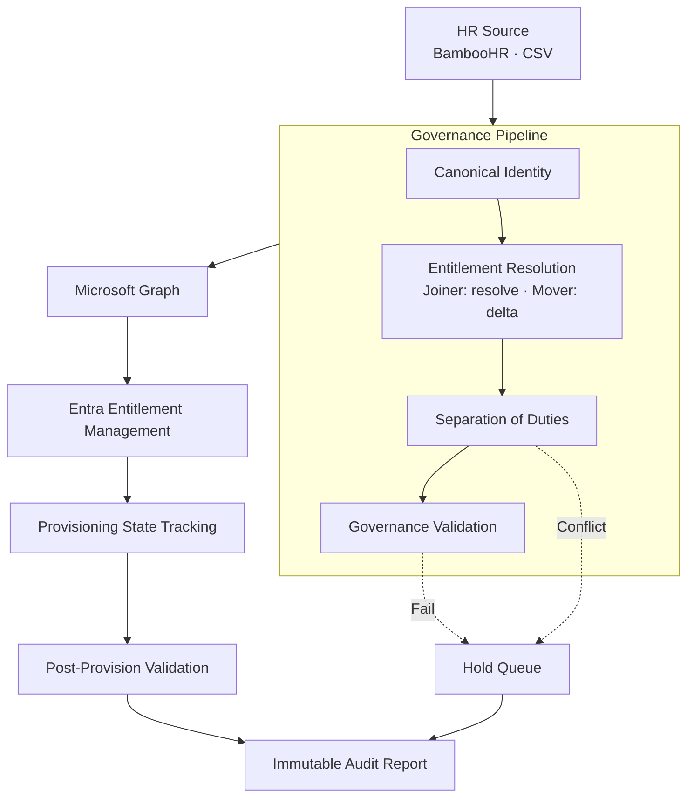

# Policy-Driven Identity Lifecycle Engine

Governance-first Joiner, Mover, and Leaver automation for Microsoft Entra ID.

This engine resolves policy into Microsoft Entra Access Packages, validates governance before provisioning, orchestrates entitlement delivery, and verifies the resulting tenant state. Identity creation, access changes, and offboarding all go through the same governance pipeline — nothing reaches Microsoft Graph until policy evaluation passes.

A Joiner resolves entitlements from scratch. A Mover computes the delta between current and target access — additions land before removals so a failed addition never leaves someone with less access than before. A Leaver disables the account and revokes sessions first, then strips every access package and terminates active PIM sessions. Every event produces an immutable audit report at the time it happens, regardless of outcome.

> **Key idea:** Governance decides whether provisioning happens. The engine resolves entitlements, validates policy, and evaluates Separation of Duties before any identity or access change is written to Microsoft Entra ID. On offboarding, the account is locked out before access cleanup begins — a partial failure downstream still fails safe.

---

## Architecture



Nothing reaches Microsoft Graph until governance validation succeeds. The Leaver pipeline skips entitlement resolution entirely — a terminated employee doesn't need to know what they *should* have, only what they currently hold.

---

## How It Works

The engine takes an HR record (from BambooHR or CSV), normalises it into a canonical identity, and routes it by action type.

**Joiner** — resolves which Access Packages the identity should hold based on department, job title, and employment type. Runs pre-provision governance validation, creates the Entra ID user, submits Access Package assignment requests, polls each to delivery, and verifies the resulting tenant state.

**Mover** — fetches the user's current Access Package assignments and resolves entitlements for the new role. Computes a four-set delta (add, remove, unchanged, unmanaged), evaluates retention records, then executes additions before removals (ADR-009). A failed addition gates all removals — the user never ends up with less access than before. Post-move verification confirms the real tenant state matches the intended outcome.

**Leaver** — disables the account and revokes all sessions immediately, before touching access. Then removes every Access Package the user holds — managed and unmanaged, no retention check, no exclusions (ADR-014). Terminates any active PIM sessions (ADR-016). Soft-deletes the user with a configurable hold period. The account is locked out from Step 2 onward, so a partial failure at any later step still fails safe.

If any governance gate fails on a Joiner or Mover, the record goes to a hold queue with structured reason codes. No identity is created and no access is changed.

---

## Features

- Governance-first Joiner, Mover, and Leaver workflows
- Policy-based Access Package resolution (rules are JSON files, not code)
- Separation of Duties — preventive (pre-provision) and detective (tenant scan)
- Pre-provision governance validation via a separately deployed PowerShell engine
- Parallel Access Package submission with transition-based delivery tracking
- Add-before-remove ordering on Mover transitions (ADR-009)
- Disable-and-revoke-before-removal ordering on Leaver offboarding (ADR-015)
- Full removal scope on Leaver — no retention, no unmanaged exclusion (ADR-014)
- Active PIM session termination on Leaver, departing from ADR-003's Mover behaviour (ADR-016)
- Resource-oriented retention registry — time-bounded, explicitly approved, fail-closed
- Unmanaged-package detection — access the engine didn't assign is left untouched on Mover, removed on Leaver
- Conflict queue with Leaver supersede — a Leaver arriving cancels all pending Joiner/Mover events for that employee
- Post-provision and post-offboarding tenant verification against the real Entra ID object
- Deterministic, idempotent event processing (SHA-256 event ID, atomic claim, concurrency lock)
- Immutable per-event audit reports with full rule-trace
- BambooHR live ingestion with Leaver detection (status-driven), delta polling, and CSV offline mode
- Configurable soft-delete hold period on Leaver offboarding
- Azure Functions deployment with Managed Identity authentication

---

## Pipeline

```
Joiner / Mover                          Leaver
─────────────────                       ─────────────────
HR Source                               HR Source
    ↓                                       ↓
Canonical Identity                      Claim Event + Supersede
    ↓                                       ↓
Entitlement Resolution                  Fetch User + Current Packages
    ↓                                       ↓
SoD Evaluation                          Disable Account
    ↓                                       ↓
Governance Validation                   Revoke Sessions
    ↓                                       ↓
Microsoft Graph                         Remove All Access Packages
    ↓                                       ↓
Entra Entitlement Management            Terminate PIM Sessions
    ↓                                       ↓
Provisioning State Tracking             Soft Delete (configurable hold)
    ↓                                       ↓
Post-Provision Validation               Post-Offboarding Verification
    ↓                                       ↓
Audit Report                            Audit Report
```

Joiner and Mover share the same governance pipeline, diverging only at entitlement resolution. The Leaver pipeline is structurally different — no entitlement resolution, no delta, no retention. Everything moves in one direction: removal.

---

## Technology

| Layer | Technology |
|---|---|
| Runtime | Python 3.11 |
| Compute | Azure Functions |
| Identity | Microsoft Entra ID |
| API | Microsoft Graph |
| Governance | Entra Identity Governance (Entitlement Management) |
| Storage | Azure Table Storage |
| Authentication | Managed Identity |
| HR Source | BambooHR |
| Validation | PowerShell Azure Function |

---

## Project Status

| Capability | Status |
|---|---|
| Joiner provisioning | Complete |
| Mover (access package delta) | Complete |
| Leaver (full offboarding) | Complete — tested end-to-end |
| Full Joiner → Mover → Leaver lifecycle | Proven against live tenant |
| Access Package provisioning (ADR-007) | Complete |
| Leaver removal scope (ADR-014) | Complete |
| Leaver sequencing (ADR-015) | Complete |
| Active PIM termination on Leaver (ADR-016) | Complete |
| Retention registry | Complete |
| Unmanaged-package detection | Complete |
| Conflict queue with Leaver supersede | Complete |
| Action deriver — Leaver detection from BambooHR | Complete |
| Governance validation engine | In progress — decoupled for independent testing |
| Separation of Duties (platform-level, ADR-008) | Complete |
| Pre-flight incompatibility check (ADR-011) | Designed, deferred |
| Post-provision validation | In progress |
| Event store reclaim for failed events (ADR-013) | Designed, not built |
| Reconciliation pipeline (ADR-012) | Identified, not designed |
| Approval workflow integration | Planned |
| Azure deployment + CI/CD | Planned |
| Durable Functions migration | Planned |

---

## Design Principles

- **Governance before access.** The validation gate and the SoD check are hard blocks, not advisories.
- **Least privilege by policy.** Entitlements come from validated attributes against a rule set. No template or convenience access.
- **Separation of Duties enforced before provisioning.** Conflict pairs are defined as policy and enforced before access is granted, not discovered in a later certification cycle.
- **Fail closed.** Degraded data blocks the event. A false block is recoverable; a missed violation is not.
- **Fail safe on offboarding.** The Leaver disables and revokes before removing access. A partial failure downstream can't leave a terminated employee with a working account.
- **Deterministic entitlement resolution.** Same input, same access, every run.
- **Auditability by design.** Every decision traces to a rule ID. Evidence is produced at provisioning time, not reconstructed from logs.
- **Validate the tenant state, not just the API response.** Post-provision and post-offboarding verification confirms what Entra ID actually contains, not just what the Graph API said it did.

---

## Running Locally

```bash
pip install -r requirements.txt

# Joiner from CSV
python scripts/run_local.py --csv Data/sample_joiners.csv --clean

# Mover from CSV
python scripts/run_local.py --source mover --csv Data/sample_movers.csv --clean

# Leaver from CSV
python scripts/run_local.py --source leaver --csv Data/sample_leavers.csv --clean

# From BambooHR — action derived automatically (Joiner/Mover/Leaver/Skip)
python scripts/run_local.py --source api --id Acc003
python scripts/run_local.py --source api --mode delta
```

---

## Documentation

| Document | Purpose |
|---|---|
| README.md | Project overview (this file) |
| [ARCHITECTURE.md](ARCHITECTURE.md) | System design, pipeline layers, sequence diagrams |
| [DEVELOPER.md](DEVELOPER.md) | Repository layout, local setup, module reference |
| [docs/GOVERNANCE.md](docs/GOVERNANCE.md) | Governance model, preventive vs detective controls |
| [docs/ADR.md](docs/ADR.md) | Architecture Decision Records |

---

## Related Projects

| Project | Purpose |
|---|---|
| Validation Engine | Detect governance violations across Microsoft Entra ID tenants |
| Catalog Recommendation Engine | Analyse existing entitlements and recommend Access Packages |
| Policy-Driven Identity Lifecycle Engine | Governance-first lifecycle orchestration (this project) |