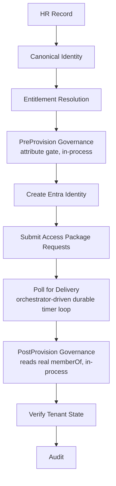
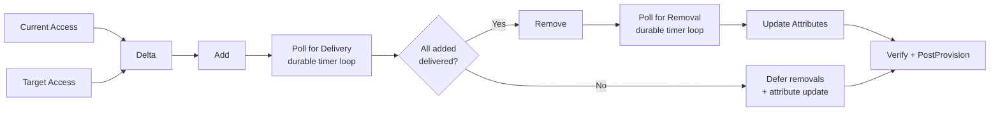
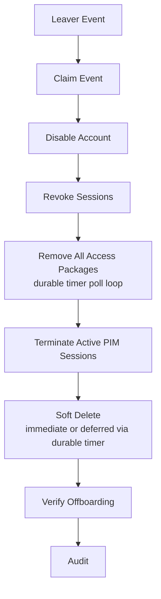
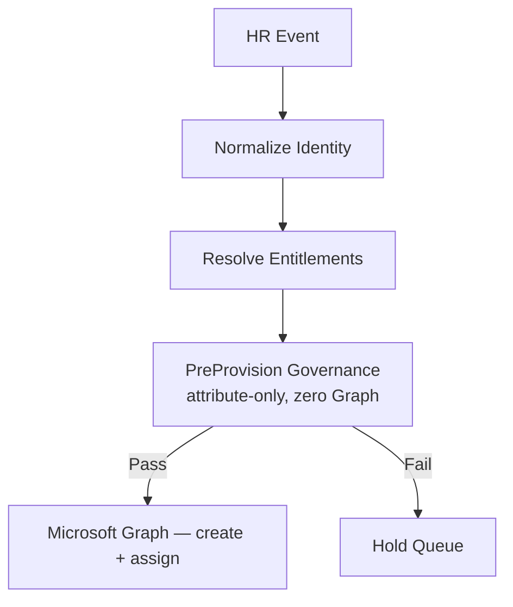
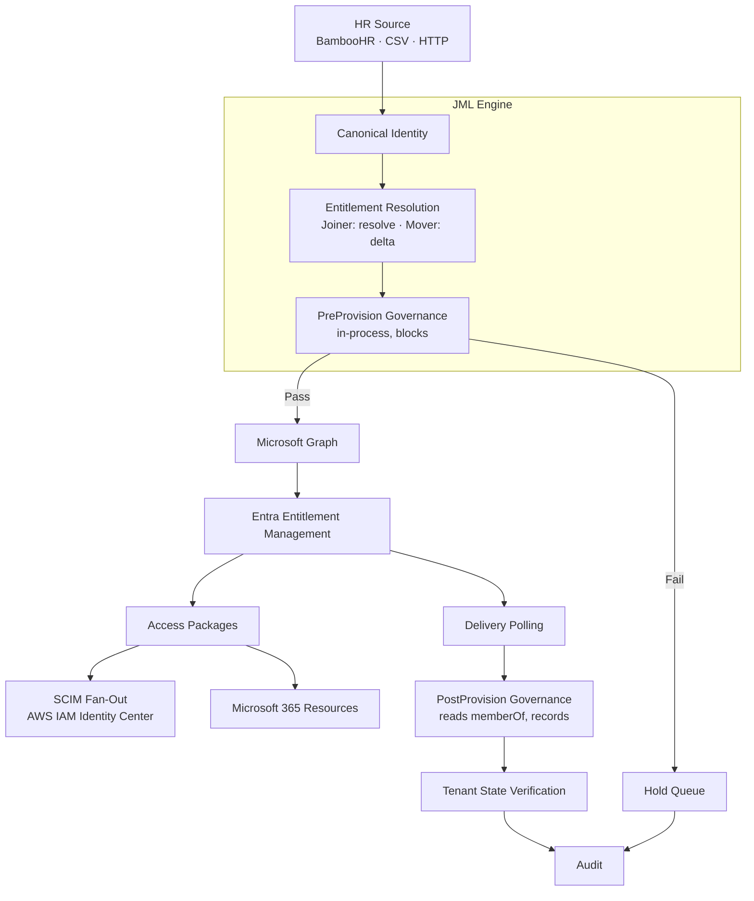

# Policy-Driven Identity Lifecycle Engine

Governance-first Joiner, Mover, and Leaver automation for **Microsoft Entra ID**, built with **Python, Azure Functions, Microsoft Graph, and Entra Entitlement Management**.

The engine turns HR lifecycle events into governed access changes. It resolves policy into **Access Packages**, evaluates governance before provisioning, orchestrates entitlement delivery, and verifies the resulting tenant state.

The complete **Joiner → Mover → Leaver** lifecycle has been tested end-to-end against a live Entra tenant, including downstream provisioning to **AWS IAM Identity Center through SCIM**.

> **Core principle:** Governance decides whether access is allowed to happen. The engine validates the request before making identity or access changes, rather than provisioning first and checking afterwards — and it verifies the resulting state after delivery.

---

## What It Does

### Joiner

A Joiner starts with an HR record and no existing identity.



Entitlements are resolved from policy using attributes such as department, job title, and employment type. The resulting Access Packages can deliver access to Microsoft 365 resources and downstream applications through SCIM.

The Joiner runs as an Azure Durable Functions orchestration: the HTTP call returns immediately, and entitlement delivery is polled through durable timers rather than a blocking wait. This removes the gateway-timeout ceiling on long deliveries — a Joiner whose packages take several minutes to deliver completes cleanly instead of being cut off.

### Mover

A Mover does not rebuild access from scratch.

The engine:

1. Reads the user's current Access Package assignments.
2. Resolves the target entitlements.
3. Calculates the access delta.
4. Evaluates retention requirements.
5. Adds new access first.
6. Waits for delivery.
7. Removes obsolete access.
8. Updates identity attributes.
9. Verifies the resulting tenant state (including PostProvision governance).

The critical property is **add-before-remove**.

If the new access cannot be delivered, the old access is not removed.

The Mover runs as an Azure Durable Functions orchestration. Like the Joiner, the HTTP call returns immediately and both the addition and removal deliveries are polled through durable timers rather than blocking waits — so a role change whose packages take several minutes to deliver completes cleanly instead of being cut off at the gateway timeout. The add-before-remove gate lives in the orchestrator: removals and the attribute update run only after every addition is confirmed delivered.



### Leaver

Offboarding follows a different safety model.

The account is disabled and sessions are revoked **before** access cleanup begins.



The Leaver does not attempt to calculate what the user *should* have. It removes what the user currently holds. It has no governance gate — removal is always the safe direction.

This makes the workflow fail-safe: if a downstream cleanup operation fails, the account has already been prevented from authenticating.

The Leaver runs as an Azure Durable Functions orchestration. Because offboarding is all-removal, every package removal is polled through durable timers rather than a blocking wait — so an offboarding whose removals take several minutes completes cleanly instead of being cut off at the gateway timeout. The disable and session revocation run first, inside the pre-removal stage, so the fail-safe holds regardless of how the rest of the run proceeds. There is one removal poll loop and no add-before-remove gate, which makes the Leaver orchestration simpler than the Mover's.

Soft delete is subject to a configurable hold (`JML_LEAVER_SOFT_DELETE_HOLD_DAYS`). When the hold is zero the user is deleted immediately; when it is nonzero the deletion is deferred and completed later by a durable timer — the orchestration sleeps out the hold, then re-checks the account is still disabled before deleting, so a re-hire reusing the same UPN during the hold is not clobbered. Everything before the delete has already locked the account out and stripped its access, so the delay is safe.

---

## Governance

The engine separates **policy**, **governance**, and **execution**. Policy defines which entitlements an identity should receive; governance evaluates whether the request and the resulting state are permissible; execution writes to the tenant.

Governance runs **in-process** inside the JML engine as two evaluation points — it is not a separate service or an HTTP call. Each is a small, event-relevant check: a lifecycle event supplies attributes and (post-delivery) real group memberships, and the check reasons about *this* identity, not the whole tenant. Tenant-wide, continuous scanning (RBAC, cross-plane exposure, MFA, hygiene, inactivity) is deliberately **out of scope** for the in-engine gate and belongs to the standalone Validation Engine (see Related Projects).

### Two governance points, two different jobs

**PreProvision — preventive, blocks.** Before any Graph write, the canonical payload is evaluated on attributes alone (employment type vs job title, UPN format, employment status) with zero Graph calls. A failure **blocks** the event — the identity is never created, the record is held. This is the fail-closed gate.



**PostProvision — detective, records.** After delivery, the check reads the identity's real group memberships (`memberOf`) and evaluates them against the entitlement model (employment type vs the tier/privilege classification of each group actually held) and against the Separation of Duties catalogue. Because the access already exists by this point, PostProvision **does not block or un-grant** — it *records* findings for review. On the Mover a finding produces `MOVE_PARTIAL` with the reason captured in the audit record. This is the detective backstop that catches what preventive controls cannot: drift, direct-assignment conflicts, and Warn-level SoD.

A failed **PreProvision** Joiner or Mover therefore does not create an identity or modify access. A **PostProvision** finding is surfaced and recorded, not silently dropped and not auto-remediated.

### Separation of Duties — layered

| Layer | When | Behaviour | Status |
| --- | --- | --- | --- |
| Platform incompatibility (Entra) | at assignment | Entra rejects a conflicting `adminAdd` on any provisioning path | Configured & proven |
| Mover pre-flight (ADR-011) | before adds, in-engine | queries incompatibility, reorders (remove-first) or blocks a genuine conflict | Planned — next build |
| PostProvision detective | after delivery | records SoD conflicts (including direct-assignment drift) for review | Built & proven |

The Separation of Duties catalogue is **group-anchored** — conflicts are authored once against real group object IDs, and platform incompatibility is derived from that. Blocking SoD is the platform's and the pre-flight's job; the in-engine PostProvision layer is detective and does not block.

---

## Architecture



The execution layer is deliberately separated from the governance decision, and governance is co-located with the orchestration that acts on it (no cross-service HTTP boundary).

### Execution Model — Durable Migration Status

Long-running entitlement delivery runs on Azure Durable Functions, so that polling waits are orchestrator-driven timers rather than blocking calls bound by the HTTP gateway timeout. All three pipelines are migrated:

| Pipeline   | Execution Model                          | Status      |
| ---------- | ---------------------------------------- | ----------- |
| **Joiner** | Durable Functions — timer-driven polling | ✅ Complete  |
| **Mover**  | Durable Functions — timer-driven polling | ✅ Complete  |
| **Leaver** | Durable Functions — timer-driven polling | ✅ Complete  |

Each pipeline also retains a synchronous execution path, used by the CSV/local runner alongside its HTTP entry point.

---

## Proven End-to-End

The lifecycle has been exercised against a live Entra tenant.

| Lifecycle             | Result                                                              |
| --------------------- | ------------------------------------------------------------------ |
| **Joiner**            | Identity created and Access Packages delivered                     |
| **Mover**             | New access added, old access removed, attributes updated           |
| **Leaver**            | Account disabled, sessions revoked, packages removed               |
| **PreProvision gate** | Contractor targeting a management-tier role blocked before any write |
| **PostProvision gate**| Contractor in a restricted duty group detected and recorded post-delivery |
| **Platform SoD**      | Conflicting Access Package assignment denied by Entra at request time |
| **AWS SCIM**          | Groups and users provisioned to AWS IAM Identity Center            |
| **AWS authorization** | Permission Set assignment and EC2 access verified                  |
| **M365**              | Native group-based Teams/SharePoint access verified               |

The important part is that this is not only a policy simulation. The workflows execute against the real Entra tenant and verify the resulting state.

---

## Key Features

* Governance-first Joiner, Mover, and Leaver automation
* In-process governance: PreProvision (preventive, blocks) and PostProvision (detective, records)
* Microsoft Entra Entitlement Management Access Packages
* Policy-driven entitlement resolution using JSON configuration
* Group-anchored Separation of Duties catalogue
* Platform-level SoD enforcement via Access Package incompatibilities
* Add-before-remove Mover sequencing
* Disable-before-remove Leaver sequencing
* Active PIM session termination during offboarding
* Configurable soft-delete hold with durable-timer deferred deletion (re-hire-safe)
* Managed and unmanaged Access Package detection
* Retention-aware Mover processing
* Leaver supersedes conflicting pending lifecycle events
* Post-provision tenant-state verification
* Post-offboarding verification
* Deterministic and idempotent event processing
* SHA-256 event identity and atomic event claiming
* Per-event audit records (written once by the engine; storage-enforced immutability planned)
* Durable Functions orchestration for the Joiner, Mover, and Leaver (timer-driven entitlement polling)
* BambooHR ingestion
* CSV offline execution
* Direct HTTP lifecycle event ingestion
* SCIM provisioning to AWS IAM Identity Center
* Native Microsoft 365 group-based access
* GitHub Actions CI/CD
* OIDC authentication between GitHub and Azure
* Azure Table Storage for state and audit data

---

## Technology

| Layer                   | Technology                                         |
| ----------------------- | -------------------------------------------------- |
| Runtime                 | Python 3.11                                        |
| Compute                 | Azure Functions — Flex Consumption                 |
| Orchestration           | Azure Durable Functions (Joiner, Mover, Leaver)    |
| Identity                | Microsoft Entra ID                                 |
| API                     | Microsoft Graph                                    |
| Governance              | In-process (Python) — PreProvision + PostProvision |
| Continuous validation   | PowerShell Azure Function (standalone scanner)     |
| Authorization           | Access Packages + Entra incompatibility (SoD)      |
| Downstream provisioning | SCIM / Microsoft 365 groups                        |
| Cloud                   | Microsoft Azure + AWS                              |
| Storage                 | Azure Table Storage                                |
| HR Source               | BambooHR                                           |
| Authentication          | OIDC / Microsoft Graph client credentials          |
| CI/CD                   | GitHub Actions                                     |

---

## Current State

### Completed

* Joiner provisioning
* Mover access-package delta processing
* Leaver offboarding
* Full Joiner → Mover → Leaver lifecycle
* Access Package provisioning
* Add-before-remove Mover protection
* Leaver disable/revoke-before-removal
* PIM session termination
* Retention evaluation
* Unmanaged access detection
* Event idempotency and concurrency control
* Conflict handling and Leaver supersede
* Tenant-state verification
* Per-event audit reporting
* Durable Functions execution for the Joiner, Mover, and Leaver (timer-driven entitlement polling)
* Deferred soft-delete completion via durable timer (re-hire-safe)
* **In-process PreProvision governance gate (preventive, blocks) — proven on tenant**
* **In-process PostProvision governance gate (detective, records; reads real memberOf) — proven on tenant**
* **Platform-level Separation of Duties via Access Package incompatibilities — configured and proven**
* **Group-anchored SoD catalogue and GUID-keyed governance model**
* BambooHR ingestion
* CSV execution
* Direct HTTP lifecycle events
* AWS IAM Identity Center SCIM integration
* Microsoft 365 group-based access
* Azure deployment through GitHub Actions

### In Progress / Planned

* **Mover pre-flight blocking SoD (ADR-011)** — query Entra incompatibility before adds; reorder (remove-first) for a legitimate transition, block a genuine conflict. Next build.
* Standalone Validation Engine as continuous, tenant-wide evaluation (scheduled scanner)
* `employment_status` field + action-deriver Leaver rule
* Last-state store for webhook-driven lifecycle processing
* BambooHR webhook ingestion
* Event-store recovery/reclaim for failed events
* Reconciliation pipeline (event repair; also the home for automated remediation of detected drift)
* Resumable recovery for a partially failed Leaver (the deferred-delete path is built; broader mid-run resume is not)
* Reviewable Mover hold queue with release/resume
* Entra Entitlement Management approval workflow integration
* Storage-enforced audit immutability (write-once blob)
* Managed Identity authentication
* Salesforce SCIM integration

---

## Calling the API

All three lifecycle pipelines accept JSON over HTTP.

The deployed Function App reads its credentials and connection strings (Graph client credentials, storage connection strings) from its application settings, configured locally in `local.settings.json`.

```bash
curl -X POST \
  "https://<function-app>.azurewebsites.net/api/joiner?code=<function-key>" \
  -H "Content-Type: application/json" \
  -d '{
    "payload": {
      "employee_id": "E001",
      "upn": "user@yourdomain.com",
      "display_name": "Example User",
      "department": "IT",
      "job_title": "IT Staff",
      "employment_type": "Employee",
      "start_date": "2026-08-15",
      "action": "Joiner"
    }
  }'
```

The same pattern is available for:

```text
/api/joiner
/api/mover
/api/leaver
```

Each pipeline additionally exposes a Durable Functions endpoint — `/api/joiner-durable`, `/api/mover-durable`, and `/api/leaver-durable` — which returns `202 Accepted` with a status URL and runs the pipeline as an orchestration. The synchronous `/api/joiner`, `/api/mover`, and `/api/leaver` endpoints remain available.

This provides the interface required for eventual HR webhook integration.

---

## Design Principles

### Governance before access

Policy and governance are evaluated before provisioning. The PreProvision gate can stop an event before any Graph write.

### Detective backstop after access

After delivery, PostProvision reads real tenant state and records anything preventive controls could not stop — drift, direct-assignment conflicts, Warn-level SoD. It reports; it does not remediate.

### Least privilege by policy

Access is derived from defined entitlement rules rather than convenience membership.

### Fail closed

When required governance information cannot be established, the lifecycle event is blocked rather than guessed.

### Fail safe on offboarding

The account is disabled and sessions revoked before access removal begins.

### Add before remove

Movers gain the required destination access before losing their existing access.

### Deterministic resolution

The same canonical identity and policy produce the same entitlement decision.

### Verify the tenant

A successful Graph API response is not treated as proof of the final state. The engine verifies what actually exists in Entra.

### Audit by design

Each lifecycle event produces an audit record containing the decision and execution outcome.

---

## Documentation

| Document                                   | Purpose                                          |
| ------------------------------------------ | ------------------------------------------------ |
| [`ARCHITECTURE.md`](ARCHITECTURE.md)       | Detailed system architecture and pipeline design |
| [`DEVELOPER.md`](DEVELOPER.md)             | Repository structure and development guide       |
| [`docs/GOVERNANCE.md`](docs/GOVERNANCE.md) | Governance model and validation controls         |
| [`docs/ADR.md`](docs/ADR.md)               | Architecture Decision Records                    |

---

## Related Projects

| Project                                     | Purpose                                                        |
| ------------------------------------------- | -------------------------------------------------------------- |
| **Validation Engine**                       | Standalone, continuous, tenant-wide detection of governance violations across Microsoft Entra ID (RBAC, cross-plane, hygiene, drift). Separate from the JML in-engine gate. |
| **Catalog Recommendation Engine**           | Analyse existing entitlements and recommend Access Packages    |
| **Policy-Driven Identity Lifecycle Engine** | Governed Joiner, Mover, and Leaver orchestration               |

---

## Project

This project is an implementation of a governance-first approach to identity lifecycle automation.

The objective is not simply to automate provisioning.

It is to make **policy, governance, authorization, execution, verification, and audit part of the same lifecycle**.