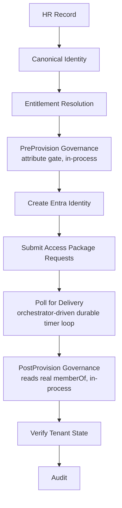
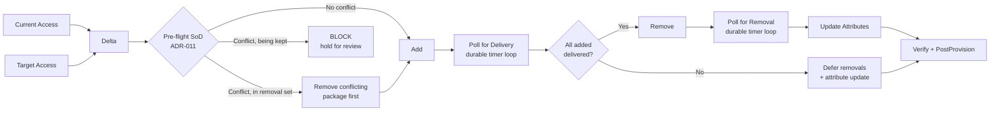
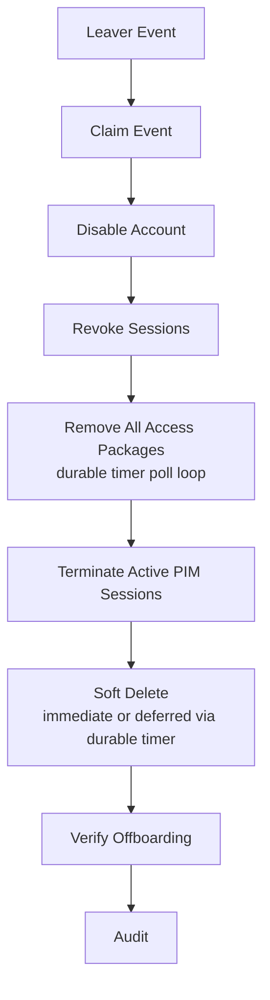
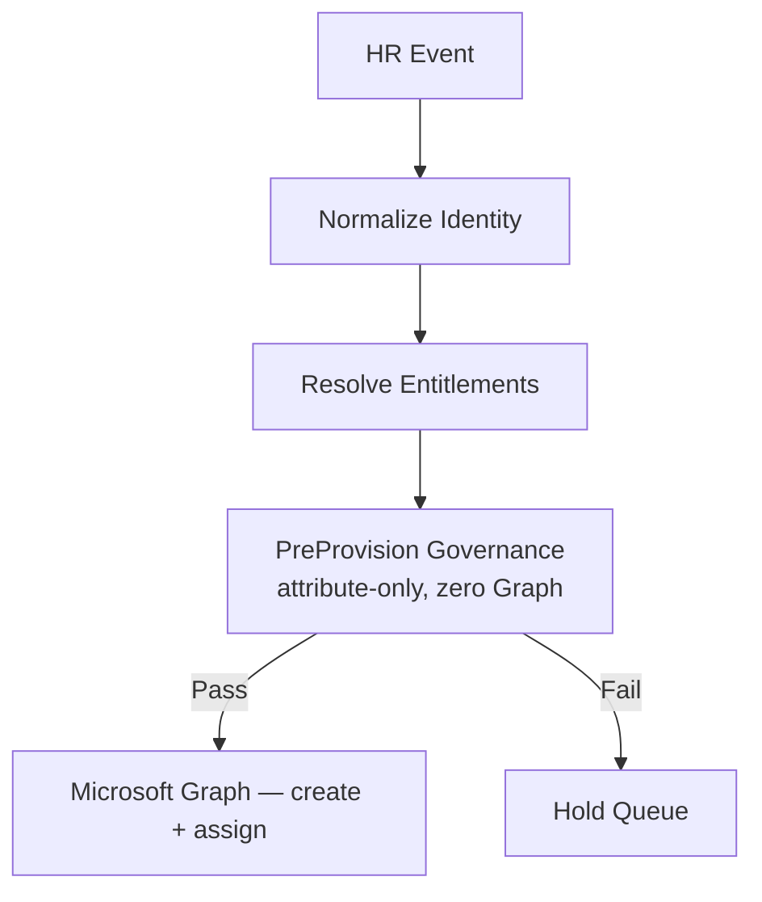
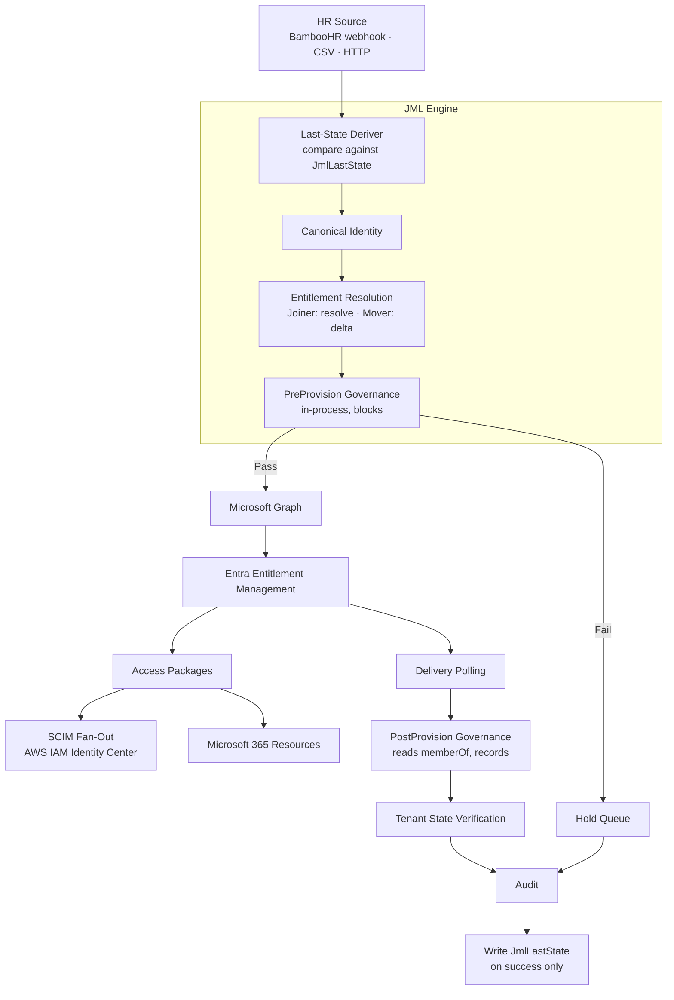

# Policy-Driven Identity Lifecycle Engine

Governance-first Joiner, Mover, and Leaver automation for **Microsoft Entra ID**, built with **Python, Azure Functions, Microsoft Graph, and Entra Entitlement Management**.

The engine turns HR lifecycle events into governed access changes. It resolves policy into **Access Packages**, evaluates governance before provisioning, orchestrates entitlement delivery, and verifies the resulting tenant state.

The complete **Joiner → Mover → Leaver** lifecycle has been exercised end-to-end against a live Entra tenant, including downstream provisioning to **AWS IAM Identity Center through SCIM**.

> **Core principle:** Governance decides whether access is allowed to happen. The engine validates the request before making identity or access changes, rather than provisioning first and checking afterwards — and it verifies the resulting state after delivery.

---

## What It Does

### Joiner

A Joiner starts with an HR record and no existing identity.



Entitlements are resolved from policy using attributes such as department, job title, and employment type. The resulting Access Packages can deliver access to Microsoft 365 resources and downstream applications through SCIM.

The Joiner runs as an Azure Durable Functions orchestration: the HTTP call returns immediately, and entitlement delivery is polled through durable timers rather than a blocking wait. This removes the gateway-timeout ceiling on long deliveries.

### Mover

A Mover does not rebuild access from scratch. The engine reads the user's current Access Package assignments, resolves the target entitlements, calculates the access delta, evaluates retention requirements, and runs a pre-flight Separation of Duties check against live Entra incompatibility configuration — then adds new access first or removes a conflicting package first, depending on what the pre-flight determined is safe.

The critical property is **add-before-remove, unless the pre-flight determines a specific conflicting package must be removed first** to avoid a platform rejection. If the new access cannot be delivered, the old access is not removed.



The Mover runs as an Azure Durable Functions orchestration. Both the addition and removal deliveries are polled through durable timers, and the add-before-remove gate lives in the orchestrator: removals and the attribute update run only after every addition is confirmed delivered.

### Leaver

Offboarding follows a different safety model. The account is disabled and sessions are revoked **before** access cleanup begins.



The Leaver does not attempt to calculate what the user *should* have. It removes what the user currently holds. There is no entitlement-resolution governance gate — removal is always the safe direction. (The trust boundary is secured at the ingestion layer; HMAC signature verification is planned.)

This makes the workflow fail-safe: if a downstream cleanup operation fails, the account has already been prevented from authenticating.

Soft delete is subject to a configurable hold (`JML_LEAVER_SOFT_DELETE_HOLD_DAYS`). When the hold is zero the user is deleted immediately; when it is nonzero the deletion is deferred and completed later by a durable timer — the orchestration sleeps out the hold, then re-checks the account is still disabled before deleting, so a rehire reusing the same UPN during the hold is not clobbered.

---

## Governance

The engine separates **policy**, **governance**, and **execution**. Policy defines which entitlements an identity should receive; governance evaluates whether the request and the resulting state are permissible; execution writes to the tenant.

Governance runs **in-process** inside the JML engine as two evaluation points — it is not a separate service or an HTTP call. Tenant-wide continuous scanning (RBAC, cross-plane exposure, MFA, hygiene, inactivity) is deliberately out of scope for the in-engine gate and belongs to the standalone Validation Engine (see Related Projects).

### Two governance points, two different jobs

**PreProvision — preventive, blocks.** Before any Graph write, the canonical payload is evaluated on attributes alone (employment type vs job title, UPN format, employment status) with zero Graph calls. A failure blocks the event — the identity is never created, the record is held.



**PostProvision — detective, records.** After delivery, the check reads the identity's real group memberships (`memberOf`) and evaluates them against the entitlement model and against the Separation of Duties catalogue. Because the access already exists by this point, PostProvision does not block or un-grant — it records findings for review. On the Mover a finding produces `MOVE_PARTIAL` with the reason captured in the audit record.

A failed PreProvision therefore does not create an identity or modify access. A PostProvision finding is surfaced and recorded, not silently dropped and not auto-remediated.

### Separation of Duties — layered

| Layer | When | Behaviour | Status |
| --- | --- | --- | --- |
| Platform incompatibility (Entra) | at assignment | Entra rejects a conflicting `adminAdd` on any provisioning path | Configured and verified |
| Mover pre-flight (ADR-011) | before adds, in-engine | Queries live Entra incompatibility configuration; reorders (remove-first) for a legitimate transition or blocks a genuine conflict | Built and verified |
| PostProvision detective | after delivery | Records SoD conflicts (including direct-assignment drift) for review | Built and verified |

The SoD catalogue is **group-anchored** — conflicts are authored once against real group object IDs, and platform incompatibility is derived from that.

The pre-flight queries Entra's `incompatibleAccessPackages` for each package a Mover would add, and classifies the result three ways: **add normally** if nothing held conflicts; **remove the conflicting package first, then add** if the conflict is with something already being removed (a legitimate transition); or **block the event and hold it for review** if the conflict is with something the user is keeping.

---

## Architecture



The execution layer is deliberately separated from the governance decision, and governance is co-located with the orchestration (no cross-service HTTP boundary).

### Execution Model

All three pipelines run on Azure Durable Functions. Polling waits are orchestrator-driven timers rather than blocking calls bound by the HTTP gateway timeout.

| Pipeline   | Execution Model                          | Status      |
| ---------- | ---------------------------------------- | ----------- |
| **Joiner** | Durable Functions — timer-driven polling | Complete  |
| **Mover**  | Durable Functions — timer-driven polling, pre-flight SoD branch | Complete  |
| **Leaver** | Durable Functions — timer-driven polling | Complete  |

Each pipeline also retains a synchronous execution path for the CSV/local runner and its HTTP entry point.

---

## Verified End-to-End

The lifecycle has been exercised against a live Entra tenant.

| Scenario | Result |
| --- | --- |
| **Joiner** | Identity created, Access Packages delivered |
| **Mover** | New access added, old access removed, attributes updated |
| **Leaver** | Account disabled, sessions revoked, packages removed |
| **PreProvision gate** | Contractor targeting a management-tier role blocked before any write |
| **PostProvision gate** | Contractor in a restricted duty group detected and recorded post-delivery |
| **Platform SoD** | Conflicting Access Package assignment denied by Entra at request time |
| **Mover pre-flight — remove-first** | Legitimate role transition correctly removed the old conflicting package, confirmed delivery, then added the new one |
| **Mover pre-flight — block** | Role change that would hold two conflicting duties was held for review before any write |
| **AWS SCIM** | Groups and users provisioned to AWS IAM Identity Center |
| **AWS authorization** | Permission Set assignment and EC2 access verified |
| **M365** | Group-based Teams/SharePoint access verified |

---

## Key Features

**Governance and Controls**
- In-process PreProvision gate (preventive, blocks) and PostProvision gate (detective, records)
- Group-anchored Separation of Duties catalogue with three enforcement layers
- Mover pre-flight SoD — queries live Entra incompatibility configuration before any write
- Add-before-remove Mover sequencing with pre-flight-driven remove-first override
- Disable-before-remove Leaver sequencing
- Post-provision and post-offboarding tenant-state verification
- Deterministic and idempotent event processing (SHA-256 event identity, atomic claiming)

**Lifecycle Orchestration**
- Durable Functions orchestration for all three pipelines (timer-driven delivery polling)
- Policy-driven entitlement resolution using JSON configuration
- Retention-aware Mover processing
- Active PIM session termination during offboarding
- Configurable soft-delete hold with durable-timer deferred deletion (rehire-safe)
- Leaver supersedes conflicting pending lifecycle events
- Managed and unmanaged Access Package detection
- Per-event audit records

**Ingestion and State**
- BambooHR webhook ingestion — real-time lifecycle events dispatched to durable orchestrators
- Last-state-driven action classification — compares incoming HR record against the last reconciled state (no Graph API call needed)
- JmlLastState store (Azure Table Storage) with write-on-success semantic
- Bootstrap seeding for go-live baseline population
- Rehire detection — terminated rows retained so a returning employee is correctly classified
- CSV offline execution and direct HTTP ingestion

**Cross-Cloud**
- SCIM provisioning to AWS IAM Identity Center
- Microsoft 365 group-based access
- OIDC authentication between GitHub and Azure

---

## Technology

| Layer | Technology |
| --- | --- |
| Runtime | Python 3.11 |
| Compute | Azure Functions (Flex Consumption) |
| Orchestration | Azure Durable Functions |
| Identity | Microsoft Entra ID |
| API | Microsoft Graph |
| Governance | In-process Python — PreProvision + PostProvision |
| Authorization | Access Packages, Entra incompatibility (SoD), Mover pre-flight |
| Downstream provisioning | SCIM, Microsoft 365 groups |
| Cloud | Microsoft Azure, AWS |
| State / Audit | Azure Table Storage |
| HR Source | BambooHR (webhook + API + CSV) |
| Authentication | OIDC, Graph client credentials |
| CI/CD | GitHub Actions |

---

## Current State

### Completed

**Core lifecycle:** Joiner provisioning, Mover access-package delta processing, Leaver offboarding, full Joiner → Mover → Leaver lifecycle exercised end-to-end.

**Governance:** In-process PreProvision gate (preventive, blocks), in-process PostProvision gate (detective, reads real `memberOf`), platform-level SoD via Access Package incompatibilities, group-anchored SoD catalogue, Mover pre-flight SoD (ADR-011) — all verified on tenant.

**Orchestration:** Durable Functions execution for all three pipelines, add-before-remove Mover protection, disable/revoke-before-removal Leaver sequencing, PIM session termination, retention evaluation, deferred soft-delete with rehire safety, unmanaged access detection, event idempotency and concurrency control, conflict handling and Leaver supersede, tenant-state verification, per-event audit reporting.

**Ingestion:** BambooHR webhook ingestion with real-time dispatch to durable orchestrators, last-state store (JmlLastState) with write-on-success semantic, last-state deriver for Joiner/Mover/Leaver/Skip classification (no Graph API call needed), bootstrap seed script for go-live baseline, rehire detection, CSV execution, direct HTTP lifecycle events.

**Integration:** AWS IAM Identity Center SCIM provisioning, Microsoft 365 group-based access, Azure deployment through GitHub Actions with OIDC authentication.

### In Progress / Planned

- Webhook-layer idempotency + HMAC signature verification
- Reviewable Mover hold queue with release/resume (pre-flight BLOCK events currently write to an in-memory hold, not a persistent queue)
- Standalone Validation Engine as continuous, tenant-wide evaluation (scheduled scanner)
- Event-store recovery/reclaim for failed events
- Reconciliation pipeline (event repair and automated drift remediation)
- Resumable recovery for a partially failed Leaver (deferred-delete path is built; broader mid-run resume is not)
- Entra Entitlement Management approval workflow integration
- Storage-enforced audit immutability (write-once blob)
- Managed Identity authentication
- Salesforce SCIM integration

---

## Calling the API

All three lifecycle pipelines accept JSON over HTTP. The deployed Function App reads credentials and connection strings from application settings (configured locally in `local.settings.json`).

```bash
curl -X POST \
  "https://<function-app>.azurewebsites.net/api/joiner?code=<function-key>" \
  -H "Content-Type: application/json" \
  -d '{
    "payload": {
      "employee_id": "E001",
      "upn": "user@yourdomain.com",
      "display_name": "Example User",
      "department": "IT",
      "job_title": "IT Staff",
      "employment_type": "Employee",
      "start_date": "2026-08-15",
      "action": "Joiner"
    }
  }'
```

| Endpoint | Mode |
| --- | --- |
| `/api/joiner`, `/api/mover`, `/api/leaver` | Synchronous |
| `/api/joiner-durable`, `/api/mover-durable`, `/api/leaver-durable` | Durable (returns `202 Accepted` with status URL) |
| `/api/webhook_bamboohr` | Webhook — dispatches to durable orchestrators |

### BambooHR Webhook

The webhook endpoint receives BambooHR events, fetches the full employee record, maps it to the canonical identity shape, and classifies the lifecycle action by comparing against the last reconciled state in JmlLastState. The correct durable orchestrator (Joiner, Mover, or Leaver) is dispatched automatically. Each orchestrator writes the mapped record back to JmlLastState on successful completion.

The webhook accepts multiple payload shapes:

```bash
# Event-based
{"data": {"employeeId": "123"}}

# Standard
{"employees": [{"id": "123"}]}

# Single-event shorthand
{"employee_id": "123"}
```

> **Note:** The webhook is currently secured by function key. HMAC signature verification is planned.

---

## Design Principles

**Governance before access.** Policy and governance are evaluated before provisioning. The PreProvision gate can stop an event before any Graph write, and the Mover pre-flight can stop or reorder a role change before any package is submitted.

**Detective backstop after access.** After delivery, PostProvision reads real tenant state and records anything preventive controls could not stop — drift, direct-assignment conflicts, Warn-level SoD. It reports; it does not remediate.

**Least privilege by policy.** Access is derived from defined entitlement rules rather than convenience membership.

**Fail closed.** When required governance information cannot be established, the lifecycle event is blocked.

**Fail safe on offboarding.** The account is disabled and sessions revoked before access removal begins.

**Add before remove — unless a conflict says otherwise.** Movers gain destination access before losing existing access, except where the pre-flight has determined a conflicting package must be removed first.

**Deterministic resolution.** The same canonical identity and policy produce the same entitlement decision.

**Verify the tenant.** A successful Graph API response is not treated as proof of the final state. The engine verifies what actually exists in Entra.

**Audit by design.** Each lifecycle event produces an audit record containing the decision and execution outcome.

---

## Documentation

| Document | Purpose |
| --- | --- |
| [`ARCHITECTURE.md`](ARCHITECTURE.md) | System architecture and pipeline design |
| [`DEVELOPER.md`](DEVELOPER.md) | Repository structure and development guide |
| [`docs/GOVERNANCE.md`](docs/GOVERNANCE.md) | Governance model and validation controls |
| [`docs/ADR.md`](docs/ADR.md) | Architecture Decision Records |

---

## Related Projects

| Project | Purpose |
| --- | --- |
| **Validation Engine** | Standalone, continuous, tenant-wide detection of governance violations across Microsoft Entra ID (RBAC, cross-plane, hygiene, drift). Separate from the JML in-engine gate. |
| **Catalog Recommendation Engine** | Analyse existing entitlements and recommend Access Packages |