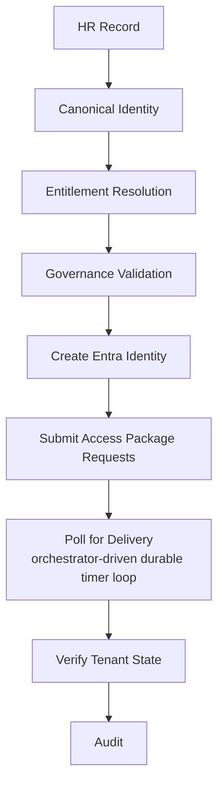
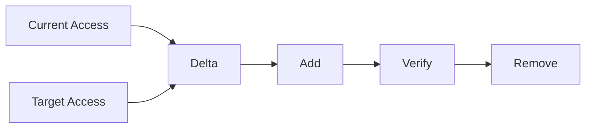
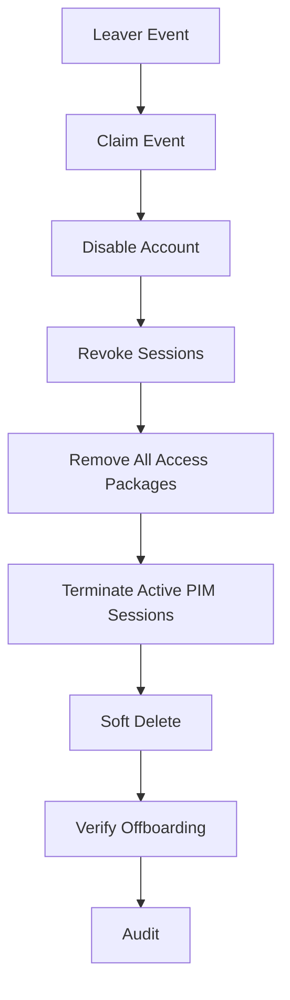
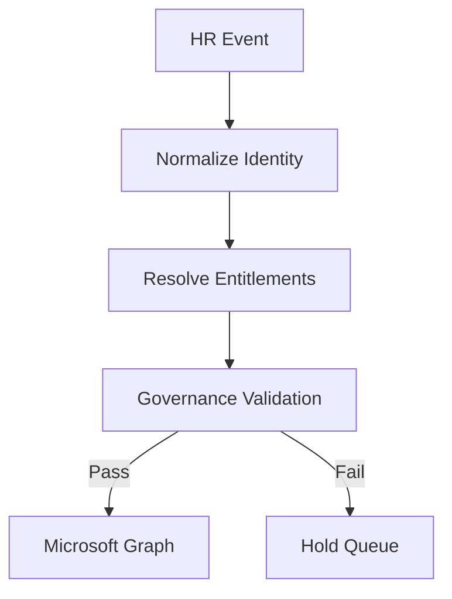
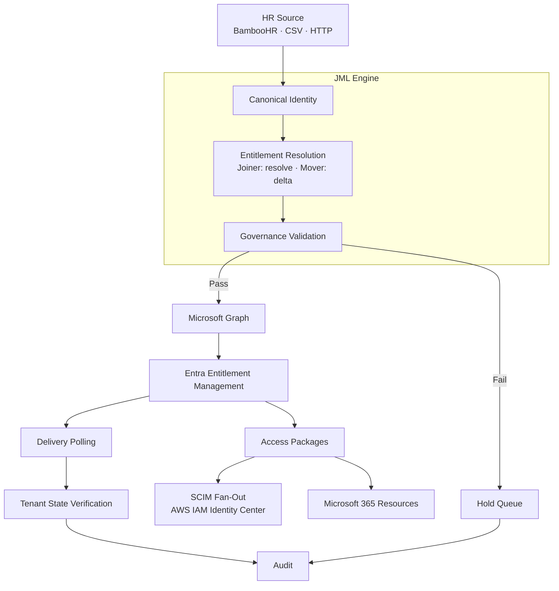

# Policy-Driven Identity Lifecycle Engine

Governance-first Joiner, Mover, and Leaver automation for **Microsoft Entra ID**, built with **Python, Azure Functions, Microsoft Graph, and Entra Entitlement Management**.

The engine turns HR lifecycle events into governed access changes. It resolves policy into **Access Packages**, evaluates governance before provisioning, orchestrates entitlement delivery, and verifies the resulting tenant state.

The complete **Joiner → Mover → Leaver** lifecycle has been tested end-to-end against a live Entra tenant, including downstream provisioning to **AWS IAM Identity Center through SCIM**.

> **Core principle:** Governance decides whether access is allowed to happen. The engine validates the request before making identity or access changes, rather than provisioning first and checking afterwards.

---

## What It Does

### Joiner

A Joiner starts with an HR record and no existing identity.



Entitlements are resolved from policy using attributes such as department, job title, and employment type. The resulting Access Packages can deliver access to Microsoft 365 resources and downstream applications through SCIM.

The Joiner runs as an Azure Durable Functions orchestration: the HTTP call returns immediately, and entitlement delivery is polled through durable timers rather than a blocking wait. This removes the gateway-timeout ceiling on long deliveries — a Joiner whose packages take several minutes to deliver completes cleanly instead of being cut off.

### Mover

A Mover does not rebuild access from scratch.

The engine:

1. Reads the user's current Access Package assignments.
2. Resolves the target entitlements.
3. Calculates the access delta.
4. Evaluates retention requirements.
5. Adds new access first.
6. Waits for delivery.
7. Removes obsolete access.
8. Updates identity attributes.
9. Verifies the resulting tenant state.

The critical property is **add-before-remove**.

If the new access cannot be delivered, the old access is not removed.



### Leaver

Offboarding follows a different safety model.

The account is disabled and sessions are revoked **before** access cleanup begins.



The Leaver does not attempt to calculate what the user *should* have. It removes what the user currently holds.

This makes the workflow fail-safe: if a downstream cleanup operation fails, the account has already been prevented from authenticating.

---

## Governance First

The engine separates **policy**, **governance**, and **execution**.

Policy defines which entitlements an identity should receive. Governance evaluates whether those entitlements are permissible.

For example, the policy model explicitly describes:

* permitted employment types
* privileged classifications
* entitlement tiers
* job-title-to-entitlement mappings
* identity rules
* access rules
* RBAC rules
* cross-plane exposure rules
* hygiene controls

Privileged access is represented explicitly in the entitlement model rather than inferred solely from naming conventions or group tiers.

A governance failure blocks the lifecycle event.



A failed Joiner or Mover therefore does not create an identity or modify access.

---

## Architecture



The execution layer is deliberately separated from the governance decision.

### Execution Model — Durable Migration Status

Long-running entitlement delivery is being migrated to Azure Durable Functions, so that polling waits are orchestrator-driven timers rather than blocking calls bound by the HTTP gateway timeout. The migration is per-pipeline:

| Pipeline   | Execution Model                          | Status      |
| ---------- | ---------------------------------------- | ----------- |
| **Joiner** | Durable Functions — timer-driven polling | ✅ Complete  |
| **Mover**  | Synchronous                              | 🚧 Planned  |
| **Leaver** | Synchronous                              | 🚧 Planned  |

Each pipeline also retains a synchronous execution path, used by the CSV/local runner alongside its HTTP entry point.

---

## Proven End-to-End

The lifecycle has been exercised against a live Entra tenant.

| Lifecycle             | Result                                                   |
| --------------------- | -------------------------------------------------------- |
| **Joiner**            | Identity created and Access Packages delivered           |
| **Mover**             | New access added, old access removed, attributes updated |
| **Leaver**            | Account disabled, sessions revoked, packages removed     |
| **AWS SCIM**          | Groups and users provisioned to AWS IAM Identity Center  |
| **AWS authorization** | Permission Set assignment and EC2 access verified        |
| **M365**              | Native group-based Teams/SharePoint access verified      |

The important part is that this is not only a policy simulation. The workflows execute against the real Entra tenant and verify the resulting state.

---

## Key Features

* Governance-first Joiner, Mover, and Leaver automation
* Microsoft Entra Entitlement Management Access Packages
* Policy-driven entitlement resolution using JSON configuration
* Add-before-remove Mover sequencing
* Disable-before-remove Leaver sequencing
* Active PIM session termination during offboarding
* Managed and unmanaged Access Package detection
* Retention-aware Mover processing
* Leaver supersedes conflicting pending lifecycle events
* Post-provision tenant-state verification
* Post-offboarding verification
* Deterministic and idempotent event processing
* SHA-256 event identity and atomic event claiming
* Per-event audit records (written once by the engine; storage-enforced immutability planned)
* Durable Functions orchestration for the Joiner (timer-driven entitlement polling)
* BambooHR ingestion
* CSV offline execution
* Direct HTTP lifecycle event ingestion
* SCIM provisioning to AWS IAM Identity Center
* Native Microsoft 365 group-based access
* GitHub Actions CI/CD
* OIDC authentication between GitHub and Azure
* Azure Table Storage for state and audit data

---

## Technology

| Layer                   | Technology                                         |
| ----------------------- | -------------------------------------------------- |
| Runtime                 | Python 3.11                                        |
| Compute                 | Azure Functions — Flex Consumption                 |
| Orchestration           | Azure Durable Functions (Joiner)                   |
| Identity                | Microsoft Entra ID                                 |
| API                     | Microsoft Graph                                    |
| Governance              | Entra Identity Governance / Entitlement Management |
| Authorization           | Access Packages                                    |
| Downstream provisioning | SCIM / Microsoft 365 groups                        |
| Cloud                   | Microsoft Azure + AWS                              |
| Storage                 | Azure Table Storage                                |
| HR Source               | BambooHR                                           |
| Authentication          | OIDC / Microsoft Graph client credentials          |
| CI/CD                   | GitHub Actions                                     |
| Validation              | PowerShell Azure Function                          |

---

## Current State

### Completed

* Joiner provisioning
* Mover access-package delta processing
* Leaver offboarding
* Full Joiner → Mover → Leaver lifecycle
* Access Package provisioning
* Add-before-remove Mover protection
* Leaver disable/revoke-before-removal
* PIM session termination
* Retention evaluation
* Unmanaged access detection
* Event idempotency and concurrency control
* Conflict handling and Leaver supersede
* Tenant-state verification
* Per-event audit reporting
* Durable Functions execution for the Joiner (timer-driven entitlement polling)
* Synthetic identity ID for pre-provision governance (payload side)
* BambooHR ingestion
* CSV execution
* Direct HTTP lifecycle events
* AWS IAM Identity Center SCIM integration
* Microsoft 365 group-based access
* Azure deployment through GitHub Actions

### In Progress / Planned

* Durable Functions migration for Mover and Leaver (Joiner complete)
* Synthetic identity consumption in the validation engine (re-coupling)
* Last-state store for webhook-driven lifecycle processing
* BambooHR webhook ingestion
* Event-store recovery/reclaim
* Reconciliation pipeline
* Resumable Leaver recovery
* Entra Entitlement Management approval workflow integration
* Separation of Duties enforcement (platform-level, via Access Package incompatibilities — ADR-008)
* Platform-enforced incompatible Access Package pre-flight check (ADR-011)
* Salesforce SCIM integration

---

## Running Locally

```bash
pip install -r requirements.txt

# Joiner
python scripts/run_local.py \
  --csv Data/sample_joiners.csv \
  --clean

# Mover
python scripts/run_local.py \
  --source mover \
  --csv Data/sample_movers.csv \
  --clean

# Leaver
python scripts/run_local.py \
  --source leaver \
  --csv Data/sample_leavers.csv \
  --clean

# BambooHR — derive lifecycle action automatically
python scripts/run_local.py \
  --source api \
  --id Acc003

python scripts/run_local.py \
  --source api \
  --mode delta
```

---

## Calling the API

All three lifecycle pipelines accept JSON over HTTP.

```bash
curl -X POST \
  "https://<function-app>.azurewebsites.net/api/joiner?code=<function-key>" \
  -H "Content-Type: application/json" \
  -d '{
    "payload": {
      "employee_id": "E001",
      "upn": "user@yourdomain.com",
      "display_name": "Example User",
      "department": "IT",
      "job_title": "IT Staff",
      "employment_type": "Employee",
      "start_date": "2026-08-15",
      "action": "Joiner"
    }
  }'
```

The same pattern is available for:

```text
/api/joiner
/api/mover
/api/leaver
```

The Joiner additionally exposes a Durable Functions endpoint, `/api/joiner-durable`, which returns `202 Accepted` with a status URL and runs the pipeline as an orchestration. The synchronous `/api/joiner` endpoint remains available.

This provides the interface required for eventual HR webhook integration.

---

## Design Principles

### Governance before access

Policy and governance are evaluated before provisioning.

### Least privilege by policy

Access is derived from defined entitlement rules rather than convenience membership.

### Fail closed

When required governance information cannot be established, the lifecycle event is blocked rather than guessed.

### Fail safe on offboarding

The account is disabled and sessions revoked before access removal begins.

### Add before remove

Movers gain the required destination access before losing their existing access.

### Deterministic resolution

The same canonical identity and policy produce the same entitlement decision.

### Verify the tenant

A successful Graph API response is not treated as proof of the final state. The engine verifies what actually exists in Entra.

### Audit by design

Each lifecycle event produces an audit record containing the decision and execution outcome.

---

## Documentation

| Document                                   | Purpose                                          |
| ------------------------------------------ | ------------------------------------------------ |
| [`ARCHITECTURE.md`](ARCHITECTURE.md)       | Detailed system architecture and pipeline design |
| [`DEVELOPER.md`](DEVELOPER.md)             | Repository structure and development guide       |
| [`docs/GOVERNANCE.md`](docs/GOVERNANCE.md) | Governance model and validation controls         |
| [`docs/ADR.md`](docs/ADR.md)               | Architecture Decision Records                    |

---

## Related Projects

| Project                                     | Purpose                                                        |
| ------------------------------------------- | -------------------------------------------------------------- |
| **Validation Engine**                       | Detect governance violations across Microsoft Entra ID tenants |
| **Catalog Recommendation Engine**           | Analyse existing entitlements and recommend Access Packages    |
| **Policy-Driven Identity Lifecycle Engine** | Governed Joiner, Mover, and Leaver orchestration               |

---

## Project

This project is an implementation of a governance-first approach to identity lifecycle automation.

The objective is not simply to automate provisioning.

It is to make **policy, governance, authorization, execution, verification, and audit part of the same lifecycle**.